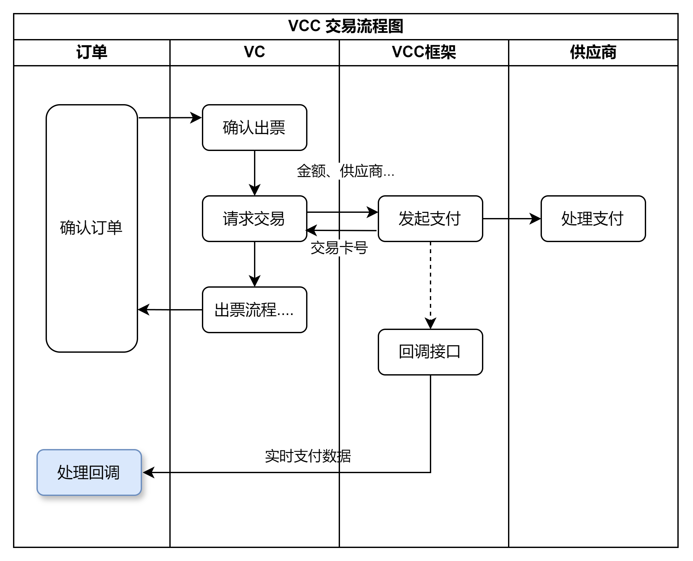
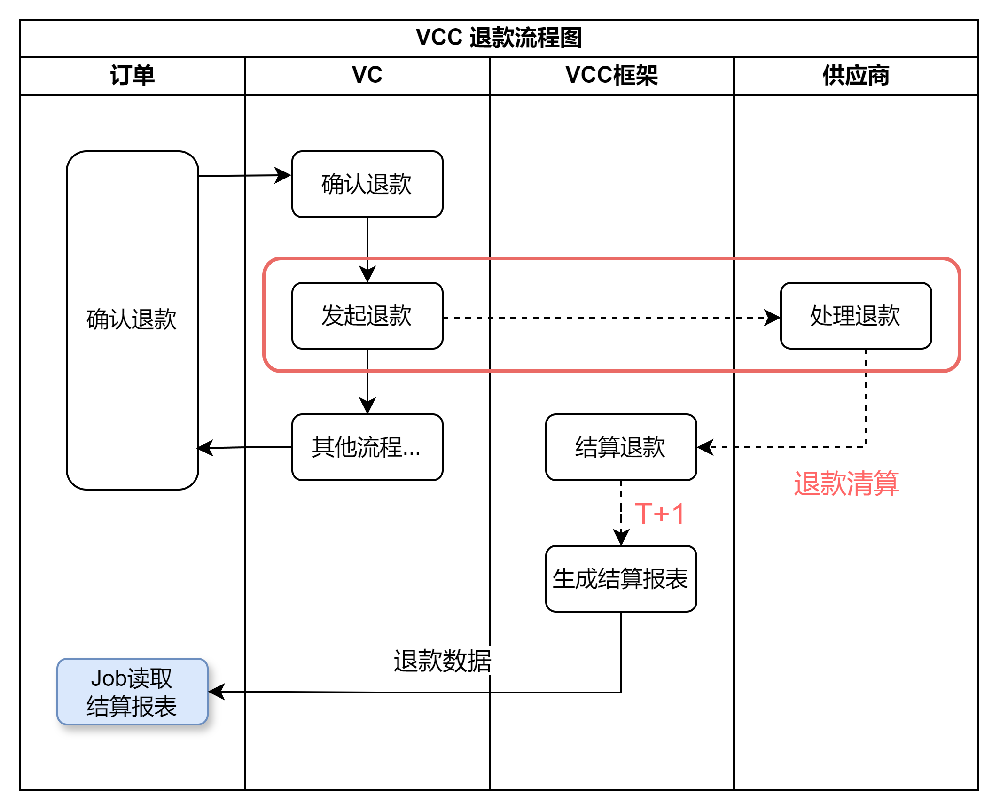
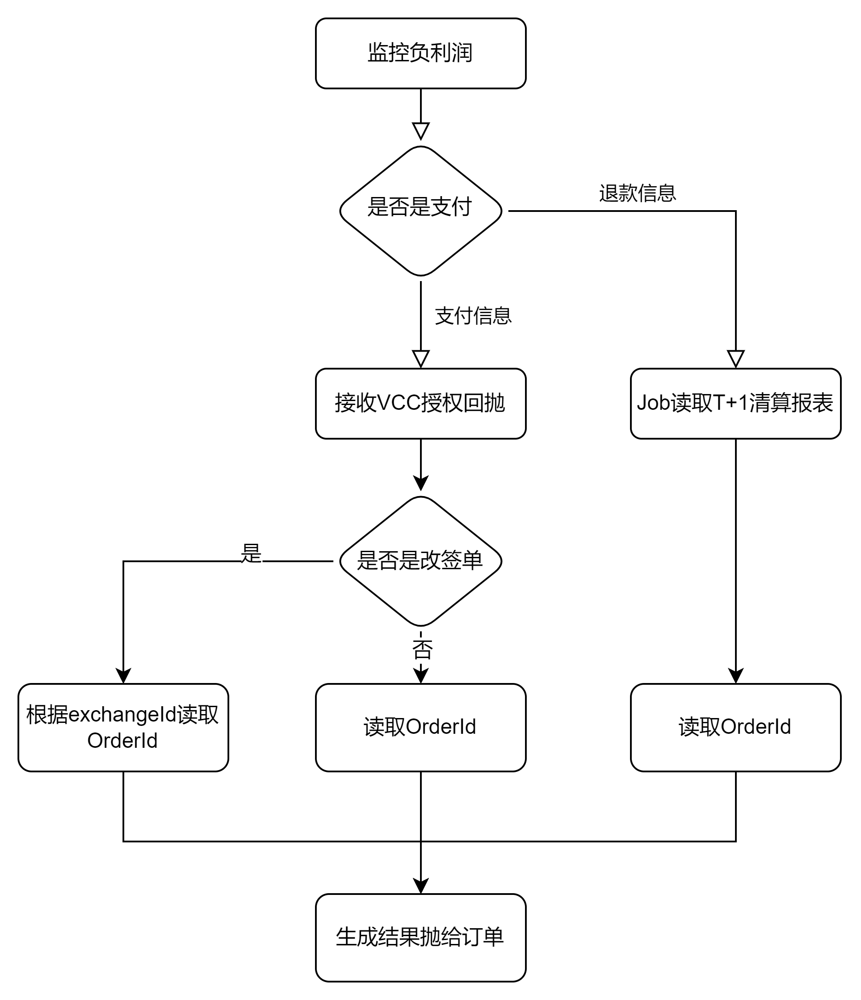
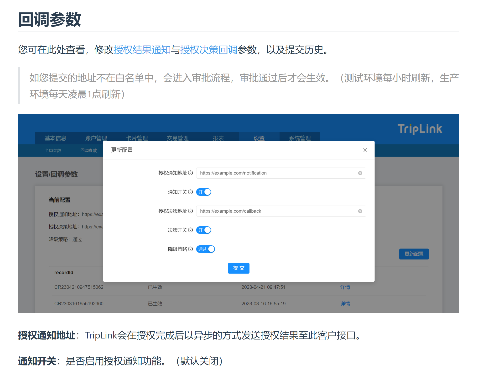

> **已提炼至 Obsidian 主库，本文仅作考古参考，请勿继续追加。**
>
> - 绩效：[[绩效/2024H1-半年报]]
> - 领域：[[领域/订单ID层级与批次号]]、[[领域/VCC实付对账模型]]、[[领域/退票可退维度问题集]]、[[领域/通票X产品人工出退改]]
> - 工程：[[工程/Offline前后端联调套路]]、[[工程/票台排障路径]]

---

## 熟悉业务

* 名词解释
* 字段
* 流程梳理
+ admin + offline + code
+ 整个流程
- place order (gds order)
- split order （for uktis）
- x create order
- book seat for each subOrder（supplier create order）
* create order for each subOrder
* search solution //uktis
- get price 返回渠道
- pay
- complete for each subOrder （supplier）
- gds ticket
- 更新order
+ 老系统创单流程
- SupplierCreateOrderProcessor :
* get suppier Code
* getBookingService By code
+ AbstractSupplierBookingService.createOrder
- logic 调用vc
- 供应商impl重写doCreateOrder
- 存缓存//重试
* 更新票据 result
+ 新系统创单流程
- CreateOrderProcessor:
* sendSplitOrderMessage
* SplitOrderConsumer -> SplitOrderProcessor
+ searchDetail
+ splitOrderLogic.doSplit
+ sendCreateSubOrderMessage forEach subOrder
+ CreateSubOrderConsumer->CreateSubOrderProcessor
- p2p booking -》老票台
- supplierOrder - 》vc
- 全部子单结束
* 查询所有子单
* build result解压
* 发送event
+ sendWaitingCreateOrderResult -> CreateOrderTimeoutConsumer 超时未支付
- SEAT\_BOOKING status （未支付）
- fail

+ seatMap流程 (老票台)
- process
- check ,get supplier
- if switch to vc (new)
* switch logic
* 根据solutionId 的@gds supplier 按照config 概率切换到vc
* GdsSupplierOrderService
- else
* SupplierBookingService 老票台
* getSupplierServiceBySupplierCode
+ refund
- apply
* 校验mticket （英铁的票种）
* 根据行程信息（出发 到达站台，时间，出行人 决定唯一的ticket）
* 英铁 自己拆单的票 不能分段退，只能全部退
*
- confirm
- appl
+ chooseSeat
+ splitPlanId = solutionId
+ 一个orderId ->1 - 2个solutionId（单程解决方案）
+ 一个solutionId-> n个orderItemId （拆票子单）
+ 一个orderItemId -> 1个fairId

### 0.3 批次号问题

每次改签 操作，会对操作的对象生成一次批次号

01 01 01 -》 02 01 02

主单号不变

子单号改变 生成新的批次， 记录改签原单orderItemId -》actualOrderId

## 1、国际负利润 vcc （Virtual Credit Card）

### 1.1 vcc payment 实时回抛、

###

+ 需求：
- 新票台
- 需要编写一个consumer接收vcc 的Message，消费，然后抛给订单系统处理，计算负利润率
+ 问题：
- 出票层需要对消息操作什么，为什么不直接让订单消费
- 是否可以让三方走退款授权
+ [流程](https://api.triplinkintl.com/v1.0/api.html#%E6%8E%88%E6%9D%83%E7%BB%93%E6%9E%9C%E9%80%9A%E7%9F%A5)
- 编写controller 接收tripLink调用
- 请求参数 获取transCurrencyAmt 、transCurrency (数字代码转化为字符代码)
- 根据卡号 查库order\_vcc\_info 获取orderItemId
- 查新库、老库（建索引）获取orderId （建索引）出现问题，改用creatTime - period
- transCurrencyAmt 、transCurrency 、 抛q（qconfig开关）
- 返回结果
- 对接vcc tplink
- 查看日志：`cat\_client\_appid = '100051894' and msg like '%vcc end%' and msg like '%refund%'`
+ 问题
- 新票台读取vc库的 vcc\_order\_info 表，
* 未来vcc集成到出票层
- 退款问题
* 接受不到退款的回调消息
+ 三方没有退款授权，生成T+1的报表
- 改签问题
* 需要supplier\_exchange\_id字段传给订单。
* vc添加字段
- needVcc问题
* 老票台部分票走老库vcc，应该迁移vc层
+ 配置全部切到vc层，出现问题，部分老搜索的订单不走vc渠道，vcc支付成功，出票失败。
+ 目前配置切换needVcc添加判断vcOrder判断

```
// 默认 三个供应商走needVcc true || 关配置 enableNeedVcc =false 的情况同时考虑非vcOrder 走VCC
if (needVcc() || !appSettingProp.enableNeedVcc() && !gdsSupplierSwitchLogic.isVCOrder(
    holder.getSupplierOrderModel().getTicketingInfo())) {
```
### 1.2 vcc refund读取报表job

+ 退款不是实时的
+ 流程
- ConfirmRefund 调用 vc 成功 会落库 refund 表 状态为 退款中
- job 捞退款中的订单 然后查询vc 是否供应退款成功，成功火车票账户钱会退给客户
- T+n等供应商退款清算，才会退钱给火车票账户。
- 清算后第二天会生成报表 T+1

### 1.3 vcc exchange

- 需要改签单 exchangeId
- 根据exchangeId查orderId
- //todo 新票台改签

### 1.3 vcc 历史数据重刷

+ payment 读库
+ refund 查表
+ 左闭右开
+ 能够支持手动刷给定日期的vcc数据

```
{
  "startDate" : "2024-10-01 00:00:00",
  "endDate" : "2024-10-10 00:00:00"
}

```
### 1.4 vcc 实时数据落地

1. 退款手续费不准确，是否会影响数据准确性？
2. 是否需要新增手续费字段
3. 数据重推job是否需要新加idc字段





|  |  |  |
| --- | --- | --- |
| 字段 | 类型 | 备注 |
| id | bigint(20) | 自增主键 |
| request\_reference\_id | varchar(64) | 请求唯一号 |
| create\_channel | varchar(24) | 开卡通道 |
| merchant\_name | varchar(24) | 商户名:用于标识各调用BU端 |
| contry\_code | varchar(8) | 国家代码：携程开户地 |
| currency | varchar(8) | 币种代码 |
| price | decimal(10,2) | 开卡金额 |
| start\_activated\_expiry\_date | date | 卡可交易日期 |
| end\_closed\_expiry\_date | date | 卡不可再交易日期 |
| credit\_limit | decimal(10,2) | 卡浮动额度,金额格式：请求按照各币种所在国(元)单位表示，eg. USD=100.00，JPY=99 |
| min\_authorisation\_amount | decimal(10,2) | 最低扣款金额 |
| max\_authorisation\_amount | decimal(10,2) | 最高扣款金额(作为卡的额度) |
| mutil\_use | tinyint(4) | 是否是多次性使用卡，只对eNett才有用;0：只能使用一次的卡，只能扣一次款 1：可多次使用的卡  |
| order\_id | bigint(20) | 订单号 |
| card\_log\_id | varchar(64) | 卡记录ID，对于Wex,是wex生产的 对于eNett，是RTP生成的 用于后期的卡信息查询，修卡，撤销卡 |
| create\_transaction\_id | varchar(64) | 开卡标识ID，eNett会把这个值，体现在账单文件中，Wex则是用CardLogId，体现在账单中,所以请注意保存下来 |
| ctrip\_card\_info\_id | varchar(64) | 卡保存到携程卡库后的ID |
| card\_num | varchar(64) | 卡号 |
| cvc2 | varchar(32) | 卡CVV2安全码 |
| card\_expridate | varchar(32) | 卡有效期 |
| create\_status | tinyint(4) | vcc卡创建状态：0待创建、1已创建 |
| deduction\_amount | decimal(10,2) | 扣款金额 |
| deduction\_status | tinyint(4) | 扣款状态：0 未扣款、2已扣款 |
| create\_time | datetime | 创建时间 |
| DataChange\_LastTime | datetime(3) | 最后更新时间 |
| userdata\_location | varchar(10) | udl属性 |
| holder\_name | varchar(64) | 持有卡人 |
| supplier | varchar(8) | 供应商 |
| supplier\_order\_id | varchar(64) | 供应商订单号 |
| idc | varchar(16) | 所属idc |
| serial\_id | bigint(20) | 业务流水号（改签单号/退款单号）（已加） |
| 新增：： |  |  |
| master\_order\_id | bigint(20) | 主单号id |
| vccType | varchar(8) | Payable / Paid 应付 实付 |
| trans\_type | varchar(8) | Payment/Refund 支付退款 |
| local\_currency  | varchar(8) |  开卡币种  |
| local\_currency\_amt  | decimal(10,2) |  开卡金额  |
| transCurrency  | varchar(8) |  交易币种 |
| transCurrencyAmt  | decimal(10,2) |  交易金额  |
| 交易时间？ |  |  |

#### bizContent

|  |  |  |  |
| --- | --- | --- | --- |
| 字段名称 | 数据类型 | 必填 | 说明 |
| authId | varchar | Y | 每笔授权的唯一识别号 |
| cardLogId | varchar | Y | 卡在TripLink处唯一参考号 |
| transactionId | varchar | Y | 交易ID, 授权交易与对应冲正交易的transactionId相同。 |
| cardAvailableBalance | varchar | Y | 可用卡余额 |
| occurTime | varchar | Y | 交易发生时间，格式yyyy-MM-dd HH :mm:ss |
| transCurrency | varchar | Y | 交易币种 |
| transCurrencyAmt | varchar | Y | 交易金额 |
| localCurrency | varchar | Y | 开卡币种 |
| localCurrencyAmt | varchar | Y | 交易转换为开卡币种金额 |
| respCode | varchar | Y | 见授权交易响应码枚举 |
| respCodeDesc | varchar | Y | 见授权交易响应码枚举 |
| approveCode | varchar | Y | 授权码 |
| messageType | varchar | Y | 见授权交易类型枚举 |
| messageTypeDesc | varchar | Y | 见授权交易类型枚举 |
| reversalType | varchar(2) | Y | 仅授权类型为6930或6940时有值。0：系统冲正；1：非系统冲正。 |
| useRef1Txt | varchar | N | 用户自定义字段1 |
| useRef2Txt | varchar | N | 用户自定义字段2 |
| useRef3Txt | varchar | N | 用户自定义字段3 |
| useRef4Txt | varchar | N | 用户自定义字段4 |
| useRef5Txt | varchar | N | 用户自定义字段5 |
| merchantName | varchar | N | 商户名称 |
| merchantCategoryCode | varchar | N | 商户MCC |
| merchantId | varchar | N | 商户id |
| merchantCountry | varchar | N | 商户国家 |
| merchantCity | varchar | N | 商户城市 |
| merchantPostcode | varchar | N | 商户邮编 |
| acquirerId | varchar | N | 收单行id |
| crossBorderType | varchar | N | 交易是否跨境。0：境内；1：境外。 |

#### 清算报表

|  |  |  |
| --- | --- | --- |
| VANhistoryID |  |  |
| CardlogID |  |  |
| ProductCode |  |  |
| TransID |  |  |
| ActivityType |  |  |
| IssuedToECN |  |  |
| VAN |  |  |
| TransDate |  |  |
| TransTime |  |  |
| TransCurr |  |  |
| TransAmt |  |  |
| POSAmt |  |  |
| POSCurr |  |  |
| ReconciliationAmount |  |  |
| ReconciliationCurrency |  |  |
| RequestedDate |  |  |
| RequestedTime |  |  |
| LocalTime |  |  |
| AuthTime |  |  |
| MinAmt |  |  |
| VANAmt |  |  |
| MaxAmt |  |  |
| ActivationDate |  |  |
| AuthAmt |  |  |
| AuthCurr |  |  |
| AuthCode |  |  |
| ValidUntil |  |  |
| MerchID |  |  |
| MerchCategoryCode |  |  |
| MerchCategoryName |  |  |
| MerchName |  |  |
| MerchAddress |  |  |
| MerchCity |  |  |
| MerchState |  |  |
| MerchPostCode |  |  |
| MerchCountry |  |  |
| CrossBoardType |  |  |
| UserReference1 |  |  |
| SupplierId |  |  |
| UserReference3 |  |  |
| UserReference4 |  |  |
| UserReference5 |  |  |
| UserReference6 |  |  |
| UserReference7 |  |  |
| UserReference8 |  |  |
| NatOrNot |  |  |
| OrderId |  |  |
| UserReference9 |  |  |
| AcquirerCountry |  |  |

#### supplier\_sub\_order\_vcc\_transaction

|  |  |  |
| --- | --- | --- |
| id | bigint(20) | 自增主键 |
| order\_id | bigint(20) | 主单号 |
| order\_item\_id | bigint(20) | 子单号 |
| card\_log\_id | varchar(64) | 卡记录ID |
| serial\_id | varchar(128) | 业务流水号（改签单号/退款单号） |
| trans\_type | varchar(8) | Payment/Refund 支付退款 |
| trans\_currency  | varchar(8) | 交易币种 |
| trans\_currency\_amt  | decimal(10,2) | 交易金额  |
| local\_currency  | varchar(8) | 开卡币种  |
| local\_currency\_amt  | decimal(10,2) | 开卡金额  |
| trans\_time | datetime | **交易时间** |
| create\_time | datetime | 创建时间 |
| DataChange\_LastTime | datetime(3) | 最后更新时间 |
| userdata\_location | varchar(10) | udl属性 |

```
Currency currency = Currency.getAvailableCurrencies()
.stream().filter(c -> c.getNumericCode() == Integer.parseInt(transCurrency))
.findAny().orElse(null);
// 用户授权查询 无currency
```

```
{
    "signature": "kqcs8/NunJW1w9cnHQp2omNGULdDG56k6drV7RSEO5UHwVHNNNV7/1s8wL1x27t75Fh9bTacyn5se4cKrjuqvn1HEhHUGaaNomptNSK8PR95K9hY6XskxRwY0ZW9cx0+KsZES74TmorZHZK8sf+HZDdyceIPga7ynPZ3QJ4qUD0\u003d",
    "bizContent": "{\"authId\":\"47c6ba35-3fa9-4b94-86e8-c3a292f42c12\",\"cardLogId\":\"3e5d07ba05b01017a4fb0f89bbd6b02085b4682b0005db63cb655252b17cefcc\",\"cardAvailableBalance\":\"9.00\",\"occurTime\":\"2021-07-20 15:40:10\",\"transCurrency\":\"840\",\"transCurrencyAmt\":\"0.50\",\"localCurrency\":\"840\",\"localCurrencyAmt\":\"0.50\",\"respCode\":\"0000\",\"respCodeDesc\":\"Authorization Approval\",\"approveCode\":\"787843\",\"messageType\":\"6810\",\"messageTypeDesc\":\"Authorization Approval\",\"reversalType\":\"\",\"useRef1Txt\":\"2107201145000293125\",\"merchantName\":\"\",\"merchantCategoryCode\":\"0005\",\"merchantId\":\"87846545546\",\"merchantCountry\":\"\",\"merchantCity\":\"\",\"merchantPostcode\":\"\",\"acquirerId\":\"213457\",\"merchantCity\":\"\",\"merchantPostcode\":\"\"}"
}
```

```
{
	"code":"0",
	"msg":"success"
}
```

```
LocalDateTime queryEndTime = orderVccInfoEntity.getCreateTime();
LocalDateTime queryBeginTime = queryEndTime.minusHours(appSettingConfig.getQueryPeriod());

SupplierSubOrderEntity subOrderEntity =
supplierSubOrderRepository.querySubOrderByOrderItemIdBetweenCreateTime(orderItemId, queryBeginTime,
                                                                       queryEndTime);
```

```
public SupplierSubOrderEntity querySubOrderByOrderItemIdBetweenCreateTime(Long orderItemId, LocalDateTime createBeginTime, LocalDateTime createEndTime) {
    SupplierSubOrderEntityExample example = new SupplierSubOrderEntityExample();
    SupplierSubOrderEntityExample.Criteria criteria = example.createCriteria();
    if (orderItemId!=null)
        criteria.andOrderItemIdEqualTo(orderItemId);
    if (createBeginTime!=null&& createEndTime!=null){
        criteria.andCreateTimeBetween(createBeginTime , createEndTime);
    }
    List<SupplierSubOrderEntity> supplierSubOrderEntities = supplierSubOrderEntityMapper.selectByExample(example);
    return CollectionUtils.isNotEmpty(supplierSubOrderEntities) ? supplierSubOrderEntities.get(0) : null;
}
```

```
{
  "transType": "refund",
  "cardLogId": "9128ca0e5a38a85d4b402323dd4591eced9e516deed71646b07f1f1b32b09bf1",
  "transTime": {
    "date": {
      "year": 2024,
      "month": 11,
      "day": 4
    },
    "time": {
      "hour": 13,
      "minute": 55,
      "second": 2,
      "nano": 0
    }
  },
  "transCurrency": "KRW",
  "transPrice": "-6200",
  "localCurrency": "KRW",
  "localPrice": "-6200",
  "orderItemId": 32603952868
}
```


* iryos改签
+ cancel Exchange
+ MapConstruct
+ git push dev
+ captain 发布 fat fws
+ 排错 gds offline -> admin ->bat
* seatmap
* 生单

## 2、applyRefund

+ Request->InnerRequest->SupplierApplyRefundRequest
+ process
- 根据request 请求 OrderFare supplierOrderSegments supplierOrderTickets supplierOrderPassengers
+ 改签流程
- apply， create ， confirmApply

### 1. 流程

- build context
* search all (master order / sub orders / passengers / segments / segment tickets)
* build subContext
* check
- check Idempotent
* master / sub orders status
- call vc async
- handle response
* refundable标识 可整单退 可部分退
* to ticket/package
* uktis 退票维度 去程 / 返程 / 去返程
+ build leg id from ticketinginfo
+ Response 匹配 all / out / in leg id
- 单票 RefundTIcket
- 多票 commonRefundTIcket
* other
+ all RefunTicket
- find target refundable Item by segment info(6)-》refunable : unrefundable
+ commonTicket
- for RefundableItem
* find target segment between depatureTime and arriveTime
* get Ticket by segment and passenger
* 判断 ticket size>1 add to commonTicketList

### 2. P2P ->X AllOrPartialRefund问题：

* 问题：
+ 存在P2P&X 不可整单退，而P2P可以整退的情况
- 订单需要P2P是否部分退 而 供应返回的是 P2P & X 可退信息
* refundableItem .productServiceType随单产品
* refundMode 单退、随单退
+ 供应返回不可整单退，实际上绑定退可以拼接出整单退的情况
- 子单行程 A -> B -> C 乘客 ① ② ③
- 整单refundFlag partial must
- refundable item
* A->B ① ②
* B->C ② ③
* B->C ③
- 1 3 可以组合成为整单退
+ 车次延误情况

```
{
    "mode": "5",
    "param": "euros",
    "staTime": "2024-12-30 11:00:00",
    "endTime":"2024-12-29 11:00:00"
}
```

```
{
  "success": true,
  "code": 200,
  "timestamp": "1735116621902",
  "refundFlag": 4,
  "totalAmount": {
    "currency": "EUR",
    "price": 340
  },
  "totalRefundableAmount": {
    "currency": "EUR",
    "price": 74
  },
  "totalRefundFee": {
    "currency": "EUR",
    "price": 266
  },
  "refundableItems": [
    {
      "supplierSegmentIds": [
        "ES9009"
      ],
      "departureLocationCode": "FR3466",
      "departureLocationName": "Paris Nord",
      "arriveLocationCode": "GB3467",
      "arriveLocationName": "London St Pancras International",
      "departureTime": "2025-01-03 07:42:00",
      "arriveTime": "2025-01-03 09:00:00",
      "passengerId": [
        700059906160100
      ],
      "sumTicketPrice": {
        "currency": "EUR",
        "price": 62
      },
      "sumRefundFee": {
        "currency": "EUR",
        "price": 25
      },
      "sumRefundablePrice": {
        "currency": "EUR",
        "price": 37
      }
    },
    {
      "supplierSegmentIds": [
        "ES9009"
      ],
      "departureLocationCode": "FR3466",
      "departureLocationName": "Paris Nord",
      "arriveLocationCode": "GB3467",
      "arriveLocationName": "London St Pancras International",
      "departureTime": "2025-01-03 07:42:00",
      "arriveTime": "2025-01-03 09:00:00",
      "passengerId": [
        700059906160101
      ],
      "sumTicketPrice": {
        "currency": "EUR",
        "price": 62
      },
      "sumRefundFee": {
        "currency": "EUR",
        "price": 25
      },
      "sumRefundablePrice": {
        "currency": "EUR",
        "price": 37
      }
    }
  ]
}
```

```
{
  "success": true,
  "code": 200,
  "message": null,
  "originErrorMessage": null,
  "traceId": null,
  "timestamp": "1735116622000",
  "refundable": false,
  "partialRefundable": true,
  "supplierOriginRefundInfoList": [
    {
      "orderItemId": 70011777178,
      "refundFlag": "REFUND_PARTIAL_MUST",
      "needReturnTicket": false,
      "totalAmount": {
        "currency": "EUR",
        "price": 340
      },
      "totalRefundableAmount": {
        "currency": "EUR",
        "price": 74
      },
      "totalRefundFee": {
        "currency": "EUR",
        "price": 266
      },
      "pointTicketingRefundInfo": null,
      "outRefundItems": null,
      "returnRefundItems": null,
      "refundTickets": null,
      "partialRefundableItems": [
        {
          "legIds": null,
          "supplierSegmentIds": [
            "ES9009"
          ],
          "departureLocationCode": "FR3466",
          "departureLocationName": "Paris Gare du Nord",
          "arriveLocationCode": "GB3467",
          "arriveLocationName": "London St Pancras International",
          "departureTime": "2025-01-03 07:42:00",
          "arriveTime": "2025-01-03 09:00:00",
          "passengerId": [
            700059906160100
          ],
          "sumTicketPrice": {
            "currency": "EUR",
            "price": 62
          },
          "sumRefundFee": {
            "currency": "EUR",
            "price": 25
          },
          "sumRefundablePrice": {
            "currency": "EUR",
            "price": 37
          },
          "productServiceType": null,
          "refundMode": null,
          "pointTicketingRefundInfo": null
        },
        {
          "legIds": null,
          "supplierSegmentIds": [
            "ES9009"
          ],
          "departureLocationCode": "FR3466",
          "departureLocationName": "Paris Gare du Nord",
          "arriveLocationCode": "GB3467",
          "arriveLocationName": "London St Pancras International",
          "departureTime": "2025-01-03 07:42:00",
          "arriveTime": "2025-01-03 09:00:00",
          "passengerId": [
            700059906160101
          ],
          "sumTicketPrice": {
            "currency": "EUR",
            "price": 62
          },
          "sumRefundFee": {
            "currency": "EUR",
            "price": 25
          },
          "sumRefundablePrice": {
            "currency": "EUR",
            "price": 37
          },
          "productServiceType": null,
          "refundMode": null,
          "pointTicketingRefundInfo": null
        }
      ],
      "multiPartialRefundableItems": null,
      "refundRefuseReasons": [
      ],
      "additionalServiceTotalRefundInfoList": null
    }
  ],
  "ticketList": [
    {
      "orderId": 70005990616,
      "orderItemId": 70011777178,
      "ticketId": 229825097115946,
      "segmentIdList": [
        700117771780000
      ],
      "passengerIdList": [
        700059906160100
      ],
      "ticketStatus": 600,
      "totalAmount": null,
      "agencyRefundableAmount": null,
      "refundFee": null,
      "supplierTotalAmount": null,
      "supplierRefundableAmount": null,
      "supplierRefundFee": null,
      "refundable": false
    },
    {
      "orderId": 70005990616,
      "orderItemId": 70011777178,
      "ticketId": 229825097115947,
      "segmentIdList": [
        700117771780000
      ],
      "passengerIdList": [
        700059906160101
      ],
      "ticketStatus": 600,
      "totalAmount": null,
      "agencyRefundableAmount": null,
      "refundFee": null,
      "supplierTotalAmount": null,
      "supplierRefundableAmount": null,
      "supplierRefundFee": null,
      "refundable": false
    },
    {
      "orderId": 70005990616,
      "orderItemId": 70011777178,
      "ticketId": 229825097115948,
      "segmentIdList": [
        700117771780100
      ],
      "passengerIdList": [
        700059906160100
      ],
      "ticketStatus": 600,
      "totalAmount": {
        "currency": "EUR",
        "price": 62
      },
      "agencyRefundableAmount": {
        "currency": "EUR",
        "price": 37
      },
      "refundFee": {
        "currency": "EUR",
        "price": 25
      },
      "supplierTotalAmount": {
        "currency": "EUR",
        "price": 62
      },
      "supplierRefundableAmount": {
        "currency": "EUR",
        "price": 37
      },
      "supplierRefundFee": {
        "currency": "EUR",
        "price": 25
      },
      "refundable": true
    },
    {
      "orderId": 70005990616,
      "orderItemId": 70011777178,
      "ticketId": 229825097115949,
      "segmentIdList": [
        700117771780100
      ],
      "passengerIdList": [
        700059906160101
      ],
      "ticketStatus": 600,
      "totalAmount": {
        "currency": "EUR",
        "price": 62
      },
      "agencyRefundableAmount": {
        "currency": "EUR",
        "price": 37
      },
      "refundFee": {
        "currency": "EUR",
        "price": 25
      },
      "supplierTotalAmount": {
        "currency": "EUR",
        "price": 62
      },
      "supplierRefundableAmount": {
        "currency": "EUR",
        "price": 37
      },
      "supplierRefundFee": {
        "currency": "EUR",
        "price": 25
      },
      "refundable": true
    }
  ],
  "commonTicketList": [
  ],
  "refundRefuseReasons": null
}
```

```
public class ApplyRefundRequest extends CommonRequest implements Serializable {

    private long orderId;

    private String issueTime;

    @Deprecated
    private long orderItemId;
    @Deprecated
    private OrderTicketInfo orderTicketInfo; // 兼容老订单

    @Deprecated
    private RefundExtraInfo refundExtraInfo;

}
```

```
    private Long orderId;
    private Long orderItemId;
    private String supplier;
    private String supplierReference;
    private String ticketingInfo;
    private BigDecimal adjustTicketAmount;
    private String supplierCurrency;
    private String refundReason;
    private BigDecimal refundFee;
    private List<Passenger> passengers;
    private String issueTime;
    private Boolean isExchanging;
    private Boolean isExchanged;
    private List<SupplierSegment> supplierSegments;

```
+ gdsPassengers // 订单层乘客 4 个大人 1个婴儿 Supplier\_Order\_Passenger 表
+ SupplierPassengers// 供应层乘客 只包含出票乘客 4个大人 PassengerId supplier\_sub\_order\_passenger表
+ subOrder 分子单退，子单分行程 去程 返程
+ 出票二十分钟内退票免手续费
+ advance ticket20分钟外不能退
+ 订单层的订单逻辑下沉
+ order Id ->n个orderItemId
+ 1个orderItemId->n个segmentId/ticketId
+ supplierSegments renfe需
* build context
* 幂等 判断订单状态
* 异步请求子单
* 处理结果
+ 处理子单维度的可退不可退
+ 行程段信息拆成票维度信息
- 单票 ->单行程 RefundTicket refundable
- 多票 ->多行程 package refundableItem
* 获取 depTIme arriveTime
* segmentTicket 按照时间sort排序 , filter:depId< segmentId <arriveId
* 根据segment getTicketId
* add to commonRefundTicket
* bug
+ subBatchId问题
+ 只能全部退，response refundableItem为空
+ response

## 3、通票接口

### 3.1 CreateXOrder

+ 生单主要落库（单程往返/坐席等级/出发日期、乘客、联系人、金额？），订单状态是200
出票，订单状态改为401
+ 人工出票接口： 可以将订单置为成功、失败，可以回填票链接，供应订单号
+ 人工出票（子单）
- 校验参数
- 出票失败
* 更新主单数据库失败，抛q
* 子单全部退票 confirmRefund
- 出票成功
* 上传票据 pdf： TicketVouchers uid subOrder
* 更新master order状态
+ 问题
- operator 怎么存 eid-ename 回填op
- supplier
- 行程这个怎么 新增depName arrName
+ 新增行程
+ 联系人地址 //纸质票 存Extra info

{"deliverInfo":"{\"deliverAddress\":\"翻斗大街\",\"contactFirstName\":\"胡图图\",\"deliverNo\":\"1111\"}"}

### 3.2 CompleteOrder

### 3.3 ManualTicketResult

* order : 100->200->400->600
* subXorder: 200->400->401->600
* 新增回填 operator
* 新增上传凭证。popconfirm

### 3.4 ManualTicketOrderList

* 前端
+ 列表页 +orderItemId
+ 搜索栏添加p2p和x产品筛选
+ 人工出票弹窗，回填supplierOrderId 和TIcketUrl 上传pdf？

通票支持人程维度？

```
{
  "createStartTime": "2024-09-19 19:56:31",
  "createEndTime": "2024-09-19 20:12:27",
  "supplier": "kkday",
  "orderStatus": 100,
  "orderId": null,
  "supplierOrderId": null,
  "operator": null,
  "page": 2,
  "pageSize": 2
}
```

```
{
  "createStartTime": "2024-09-19 19:56:31",
  "createEndTime": "2024-09-22 20:12:27",
  "supplier": "kkday",
  "operator":"TR001323-io",
  "page": 1,
  "pageSize": 2
}
```

```
{
  "meta": {
    "index": 1,
    "size": 10
  },
  "isExport": false,
  "param": {
    "startDate": "2024-09-19",
    "endDate": "2024-09-25",
    "supplier": "kkday",
    "supplierOrderId": null,
    "operatorNo": "TR001323",
    "orderStatus": "completed",
    "orderId": null,
    "orderIds": null,
    "channelOrderId": null,
    "mainOrderId": null,
    "subbatchId": null,
    "productId": null
  }
}
```

```
{
  "channelMeta": {
    "timestamp": 1712037040408,
    "channel": "ctrainintl",
    "sign": ""
  },
  "traceId": "XMMiG2S37d5MbHacWWHSQdeNeMQMEFrZ",
  "currency": "CNY",
  "uid": "M2255004003",
  "locale": "en",
  "udl": "GB",
  "orderId": 1656236549412300000,
  "subBatchId": -1,
  "orderType": [
    "PASS"
  ],
  "passDetail":{
    "productName": "test"
  },
  "supplier": "kkday",
  "supplierPrice": {
    "currency": "GBP",
    "price": 15.80
  },
  "orderDeliverInfo": {
    "deliverAddress": "f",
    "deliverNo": "aa",
    "contactPhone":"d"
  },
  "passengers": [
    {
      "gdsPassengerId": "1570696",
      "channelPassengerId": "1570696",
      "firstName": "BBBHH",
      "lastName": "BI",
      "birthday": "1998-03-04",
      "genderType": 2,
      "passengerType": 1,
      "certificate": {
        "countryCode": "CN"
      },
      "nationality": "CN"
    },
    {
      "gdsPassengerId": "1570703",
      "channelPassengerId": "1570703",
      "firstName": "AAYU",
      "lastName": "AA",
      "birthday": "2018-01-21",
      "genderType": 2,
      "passengerType": 2,
      "certificate": {
        "countryCode": "CN"
      },
      "nationality": "CN"
    }
  ],
  "contact": {
    "email": "mtgSrg@trip.cim#",
    "phoneOfCountry": "086",
    "phoneNo": "188qVON4441"
  }
}
```

```
{
  "channelMeta": {
    "timestamp": 1712037040408,
    "channel": "ctrainintl",
    "sign": ""
  },
  "traceId": "XMMiG2S37d5MbHacWWHSQdeNeMQMEFrZ",
  "currency": "CNY",
  "uid": "M2255004003",
  "locale": "en",
  "udl": "GB",
  "subBatchId":7000020347801,
  "orderId": 1128168930301633,
    "orderType": [
    "Pass"
  ]
}
```

```
{
  "channelMeta": {
    "timestamp": 1712037040408,
    "channel": "ctrainintl",
    "sign": ""
  },
  "traceId": "XMMiG2S37d5MbHacWWHSQdeNeMQMEFrZ",
  "currency": "CNY",
  "uid": "M2255004003",
  "locale": "en",
  "udl": "GB",
  "orderId": 1653735494123000000,
  "orderItemId":70006370471,
  "operator":"op",
  "supplierOrderId":"kk111",
  "resultType":"TICKET_SUCCESS",
  "ticketVouchers":[
      {
        "needUpload": true,
        "url": "http://objstore2.qa.nt.ctripcorp.com/kkday/3055039056/19KK080698486_kkday_voucher.pdf"
      }
  ],
  "extraInfo": "{\"orderId\":1653735494123002,\"orderItemId\":70005947898010101,\"bookingId\":\"kkday240912131055019db977\",\"productId\":80018940,\"packageId\":8000071470,\"supplier\":\"kkday\",\"supplierPrice\":{\"price\":151.00,\"currency\":\"CNY\"},\"supplierOrderId\":\"23KK236286827\",\"supplierOrderStatus\":\"success\",\"ticketList\":[{\"ticketUrl\":\"http://objstore2.qa.nt.ctripcorp.com/kkday/3055039056/19KK080698486_kkday_voucher.pdf\"}],\"tags\":[\"TICKET_SUCCESS\"],\"productType\":1,\"channel\":\"trainpal\"}"
}
```

```
{
  "orderId": 1128168930267075,
  "orderItemId": 70009192101,
  "resultType": "TICKET_SUCCESS",
  "reason": "",
  "supplierOrderId": "111",
  "operator": "TR037719",
  "ticketVouchers": [
    {
     "gdsPassengerId":213051284380101,
      "ticketCode": "123",
      "ticketType":"ACTIVATION_CODE"
    }
  ]
}
```

```
{
  "channelMeta": {
    "timestamp": 1712037040408,
    "channel": "ctrainintl",
    "sign": ""
  },
  "traceId": "XMMiG2S37d5MbHacWWHSQdeNeMQMEFrZ",
  "currency": "CNY",
  "uid": "M2255004003",
  "locale": "en",
  "udl": "GB",
  "orderId": 1656236549412300000,
  "orderItemId":70006897578,
  "operator":"op",
  "supplierOrderId":"kk111",
  "resultCode":1,
  "trackingNumList":["112341","23131313"],
  "ticketVouchers": [
      {
        "id": "0zm5012000dnoxywo53D2.jpg_1728356702423",
        "ticketCode": "231b31t",
        "needUpload": false,
        "ticketType": "code"
      }
  ],
  "extraInfo": "{\"orderId\":1653735494123002,\"orderItemId\":70005947898010101,\"bookingId\":\"kkday240912131055019db977\",\"productId\":80018940,\"packageId\":8000071470,\"supplier\":\"kkday\",\"supplierPrice\":{\"price\":151.00,\"currency\":\"CNY\"},\"supplierOrderId\":\"23KK236286827\",\"supplierOrderStatus\":\"success\",\"ticketList\":[{\"ticketUrl\":\"http://objstore2.qa.nt.ctripcorp.com/kkday/3055039056/19KK080698486_kkday_voucher.pdf\"}],\"tags\":[\"TICKET_SUCCESS\"],\"productType\":1,\"channel\":\"trainpal\"}"
}
```
### 3.5 ConfirmXProductRefund

* 主退票单 子退票单落库， status为419
* 由于没有vc 直接status切换为420
* 新字段refundItemInfos 替代

```
{
  "channelMeta": {
    "timestamp": 1712037040408,
    "channel": "ctrainintl",
    "sign": ""
  },
  "traceId": "XMMiG2S37d5MbHacWWHSQdeNeMQMEFrZ",
  "currency": "CNY",
  "uid": "M2255004003",
  "locale": "en",
  "udl": "GB",
  "orderId": 1128168930278790,
  "operator":"op",
  "refundReason":"yt",
  "refundItemInfos": [
      {
        "ticketIds": [7000998780301]
      }
  ],
  "refundFlowType":"manual_refund"
}
```

```
      "refundPartInfos": [
        {
          "ticketIds": [
            0
          ],
          "refundPartSegmentInfos": [
            {
              "departureLocationCode": "String",
              "departureLocationName": "String",
              "departureTime": "String",
              "arriveLocationCode": "String",
              "arriveLocationName": "String",
              "arriveTime": "String",
              "segmentId": 0,
              "passengerId": 0
            }
          ],
          "refundPartPriceDetail": {
            "sumTicketPrice": 0,
            "sumRefundFee": 0,
            "sumRefundablePrice": 0,
            "sumRefundCurrency": "String"
          },
          "productServiceType": 0,
          "refundMode": 0
        }
      ]
```

```
{
  "orderId": 1128168930277901,
  "refundItemInfos": [
    {
      "orderItemIds": [
        70009916592
      ],
      "refundPartPriceDetail": {
        "sumTicketPrice": 1973.000,
        "sumRefundFee": 73,
        "sumRefundablePrice": 1900.000,
        "sumRefundCurrency": "CNY"
      },
       "refundPartInfos": [
        {
          "ticketIds": [
            7000991659201
          ]
        },
        {
          "ticketIds": [
            7000991659202
          ]
        }
      ]
    }
  ],
  "refundFlowType": "manual_refund",
  "refundExtraInfo": {
    "refundReason": "NORMAL_REFUND",
    "operator": {
      "eid": "tr3344",
      "empName": "op"
    }
  }
}
```
### 3.6 ManualRefundResult

* 回填退票相关数据，金额
* 可退列表 / 精确到人
*

```
{
  "channelMeta": {
    "timestamp": 1712037040408,
    "channel": "ctrainintl",
    "sign": ""
  },
  "traceId": "XMMiG2S37d5MbHacWWHSQdeNeMQMEFrZ",
  "currency": "CNY",
  "uid": "M2255004003",
  "locale": "en",
  "udl": "GB",
  "orderId": 1656236549412300000,
  "subRefundId":223433647050018,
  "resultType":"REFUND_SUCCESS",
  "operator":"op",
  "refundReason":"yt",
  "supplierTotalAmount": {
    "currency": "GBP",
    "price": 15.80
  },
  "supplierRefundableAmount": {
    "currency": "GBP",
    "price": 10.81
  },
  "supplierRefundFee": {
    "currency": "GBP",
    "price": 4.99
  }
}
```

```
{
  "startTime": {"date":{"year":2024,"month":10,"day":18},"time":{"hour":10,"minute":45,"second":0,"nano":0}},
  "endTime": {"date":{"year":2024,"month":10,"day":25},"time":{"hour":10,"minute":45,"second":0,"nano":0}},
  "supplier": null,
  "orderStatus": null,
  "orderId": null,
  "supplierOrderId": null,
  "operator": null,
  "pageQueryCondition": {
    "targetPage": 2,
    "pageSize": 20
  }
}
```
### 3.6 前端相关

#### 查询列表List.jsx (Ticket.ManualTicketingList)

#### 出票弹窗pop.jsx

* 乘客table 展开 不要用check option
* 运货单号只填一个
* 失败和取消订单，能否在中台展示不同
* package name + ProductName
* 多语言
* status
* url不需要上传

### 3.7 OrderItemVOList

* 新票台查询时间限制 <3days
* fail ticket

```
{
  "pageQueryCondition": {
    "targetPage": 1,
    "pageSize": 20
  },
  "orderId": null,
  "itemStatusEnums": null,
  "startTime": {
    "date": {
      "year": 2025,
      "month": 2,
      "day": 5
    },
    "time": {
      "hour": 15,
      "minute": 39,
      "second": 9,
      "nano": 800623600
    }
  },
  "endTime": {
    "date": {
      "year": 2025,
      "month": 2,
      "day": 8
    },
    "time": {
      "hour": 15,
      "minute": 39,
      "second": 9,
      "nano": 800623600
    }
  },
  "supplierOrderIds": null
}
```
## 4、 jr人工出票

* post上传文件
+ @RequestParam 必须传入全部参数，支持文件，列表传输？

```
const formData = new FormData();
fileList.forEach((item) => {
                 formData.append('files', item);
                 });
formData.append('orderId', row.orderId);
formData.append('orderItemId', row.orderItemId);
formData.append('resultType', 'TICKET_SUCCESS');
formData.append('reason', '');
formData.append('supplierOrderId', supplierOrderId);
formData.append('ticketVoucherList', JSON.stringify(ticketVoucherList));
formData.append('segmentTicketList', JSON.stringify(segmentTicketList));
formData.append('fileTicketMap', JSON.stringify(Object.fromEntries(fileTicketMap)));
```
+ @RequestBody 不能传文件，json，可以忽略部分参数
+ 最后解决方式：@RequestParam, 集合用json 序列化然后后端再反序列化

```
List<TicketVoucherDTO> ticketVoucherDTOList =
    JsonUtil.fromJsonToList(ticketVoucherDTOListJson, TicketVoucherDTO.class);
List<SegmentTicket> segmentTicketList = JsonUtil.fromJsonToList(segmentTicketListJson, SegmentTicket.class);
Map<String, String> passengerFileMap = null;
if (StringUtils.isNotEmpty(fileTicketMapJson)) {
    passengerFileMap =
        new ObjectMapper().readValue(fileTicketMapJson, new TypeReference<Map<String, String>>() {
        });
}
```
* 改进

```
<Dragger name='file'
  multiple={true}
  headers={{
    authorization: 'authorization-text',
  }}
  onRemove={(file) => this.onRemove(file)}
  customRequest={this.upload}
  beforeUpload={(file) => this.beforeUpload(file)}
  onChange={(info) => {
    const { status } = info.file;
    if (status !== 'uploading') {
    }
    if (status === 'done') {
      message.success(`${info.file.name} file uploaded successfully.`);
    } else if (status === 'error') {
      message.error(`${info.file.name} file upload failed.`);
    }
  }} >
  <p className="ant-upload-text">点击或者拖拽上传文件</p>
</Dragger>
```
#### 前端请求后端的问题

* 请求地址 axios

```
export function sendShortMessage(data) {
    return axios({
        url: '/api/event/message/send',
        method: 'post',
        data,
    });
}
```

```
export function manualTicket(data) {
  return originAxios({
    url: '/api/newTicket/manual/result',
    method: 'post',
    data,
  });
}
```
* 请求参数
+ @RequestParam / @RequestBody
* url

```
"proxy_bak": "http://localhost:8080/",
"proxy": "http://web.globalrail.offline.train.fat20.qa.nt.ctripcorp.com/",
"localProxy": "http://localhost:3000 http://web.globalrail.offline.train.ctripcorp.com/  http://web.globalrail.offline.train.fat20.qa.nt.ctripcorp.com/  http://web.globalrail.offline.train.sinaws.tripws.com/",
```
编辑完需要重启

###

## 5、新票台offline日志

* 问题
+ 日志位置
- infrastructure层 状态机 取不到参数
- biz层
+ 日志维度
- 子单维度 √？主单维度？
+ 参数
- 失败信息： message√ / origin message?
+ 电子票

## 6、创建发票

#### createInvoice 接口

* renfe 返回urlList 同步 成功/失败
* iryos 供应抛q给email
* 退改需要给发票状态置为失败
* 老票台退改抛消息，新票台处理

```
{
  "currency": "GBP",
  "uid": "_TRXX1hym6vvt2erl",
  "locale": "en_GB",
  "udl": "GB_90009",
  "clientMetaInfo": {
    "devOs": "ios",
    "appVersion": "82350000",
    "clientId": "50861104410000203992",
    "deviceId": "61A19350-A50B-48EC-A1DD-CAF0849F2DAD_iOS"
  },
  "channelMetaInfo": {
    "channel": "trainpal",
    "timestamp": 1733811475390
  },
  "orderId": 1134766010930620,
  "orderItemId": 70011065791,
  "supplier": "renfe",
  "supplierOrderId": "3GRL3N",
  "ticketingInfo": "{\"vcOrderFlag\":1,\"outBoundTransportName\":\"AVE\",\"inBoundTransportName\":\"AVE\",\"useV7\":1,\"departureDateTime\":\"2024-12-14 06:45:00\",\"localizador\":\"3GRL3N\"}",
  "invoiceProfile": {
    "address": {
      "country": "Italia",
      "province": "Torino",
      "city": "Torino",
      "address": "Awwwwwwww",
      "countryCode": "IT",
      "provinceCode": "TO",
      "houseNumbering": "012345",
      "postalCode": "10121",
      "streetType": "BORGO"
    },
    "personType": 1,
    "firstName": "Rocco",
    "lastName": "Hi",
    "fiscalCode": "PZZMTI02S28A662R",
    "certifiedMail": "Jinlinli@trip.com",
    "recipientCode": "",
    "vatNumber": "74358844M"
  }
}
```
supplier ='iryos' and invoice\_status in(-1,0) and order\_status = 600

```
{
  "currency": "GBP",
  "uid": "",
  "locale": "en_GB",
  "clientMetaInfo": {
    "devOs": "ios",
    "appVersion": "82350000",
    "clientId": "50861033291260519181",
    "deviceId": "A1456750-33E0-4FB4-96CE-959F8F682DB9_iOS"
  },
  "channelMetaInfo": {
    "channel": "trainpal",
    "timestamp": 1733730173210
  },
  "orderId": 1134766010919436,
  "orderItemId": 70011054646,
  "supplier": "iryos",
  "supplierOrderId": "DI1S2W",
  "ticketingInfo": "{\"vcOrderFlag\":1,\"reference\":\"DI1S2W\",\"passengerMap\":{\"passenger_1\":\"700110546040100\"},\"acceptLanguage\":\"en-GB\",\"orderType\":\"ONE_WAY_IN\"}",
  "invoiceProfile": {
    "address": {
      "country": "Italia",
      "province": "Torino",
      "city": "Torino",
      "address": "Awwwwwwww",
      "countryCode": "IT",
      "provinceCode": "TO",
      "houseNumbering": "012345",
      "postalCode": "10121",
      "streetType": "BORGO"
    },
    "personType": 1,
    "firstName": "Rocco",
    "lastName": "Hi",
    "fiscalCode": "PZZMTI02S28A662R",
    "certifiedMail": "Jinlinli@trip.com",
    "recipientCode": ""
  }
}
```

```
{
  "success": true,
  "code": 200,
  "message": null,
  "originErrorMessage": null,
  "traceId": null,
  "timestamp": "1735194667529",
  "orderId": 1134766011402398,
  "invoicableSupplierOrderItemIdList": [
    "7821900618223"
  ]
}
```

```
{
  "code": 200,
  "orderId": 1688919872793335,
  "orderItemId": 70012529411,
  "supplierOrderId": "9HFGLX",
  "invoiceId": "null_9HFGLX_1736998343322",
  "supplier": "renfe",
  "segmentTicketInvoiceInfoList": [
    {
      "pdfUrl": "https://w4.renfe.es/formacion/facturas/2025-01-16/VJN46BV9L6VU4223.pdf",
      "invoiceStatus": 2,
      "segmentTicket": {
        "orderId": 1688919872793335,
        "subBatchId": 7001252939901,
        "orderItemId": 70012529411,
        "ticketId": 231611192220968,
        "segmentId": 700125294110000,
        "passengerId": 700125293990100,
        "subRefundId": -1,
        "ticketStatus": 600,
        "departureLocationCode": "ES2471",
        "departureLocationName": "Madrid-Puerta De Atocha",
        "departureTime": [
          2025,
          1,
          17,
          9,
          30
        ],
        "arriveLocationCode": "ES2394",
        "arriveLocationName": "Barcelona-Sants",
        "arriveTime": [
          2025,
          1,
          17,
          12,
          37
        ],
        "seatType": -1,
        "coachNumber": "1008",
        "seatNumber": "01C",
        "seatCode": "",
        "reservationStatus": -1,
        "actualOrderItemId": -1
      }
    },
    {
      "pdfUrl": "https://w4.renfe.es/formacion/facturas/2025-01-16/VJFVLXFC4DG24224.pdf",
      "invoiceStatus": 2,
      "segmentTicket": {
        "orderId": 1688919872793335,
        "subBatchId": 7001252939901,
        "orderItemId": 70012529411,
        "ticketId": 231611192220969,
        "segmentId": 700125294110000,
        "passengerId": 700125293990101,
        "subRefundId": -1,
        "ticketStatus": 600,
        "departureLocationCode": "ES2471",
        "departureLocationName": "Madrid-Puerta De Atocha",
        "departureTime": [
          2025,
          1,
          17,
          9,
          30
        ],
        "arriveLocationCode": "ES2394",
        "arriveLocationName": "Barcelona-Sants",
        "arriveTime": [
          2025,
          1,
          17,
          12,
          37
        ],
        "seatType": -1,
        "coachNumber": "1008",
        "seatNumber": "01D",
        "seatCode": "",
        "reservationStatus": -1,
        "actualOrderItemId": -1
      }
    }
  ]
}
```

```
{
  "code": 201,
  "orderId": 1688919872793335,
  "orderItemId": 70012529411,
  "supplierOrderId": "9HFGLX",
  "invoiceId": "null_9HFGLX_1736998343322",
  "supplier": "renfe",
  "segmentTicketInvoiceInfoList": [
  ]
}
```
## 7、obbat obtainTicket接口

* obbat只有obtain ticket之后才会上传票，不可退
* SubOrder字段 obtain\_status
* update -》 job -》queryVc-》upload-》send
* status success 提前 不query order
* 出发时间

## 8、changeTicketOption接口

supplier = 'uktis' and order\_status = 600 and ticket\_option\_change\_status in(-1)

```
{
  "clientMeta": {
    "devOs": "PC",
    "clientId": "09031018110642705605",
    "deviceId": "09031018110642705605-PC"
  },
  "channelMeta": {
    "timestamp": 1733816378549,
    "channel": "TripTrain"
  },
  "currency": "USD",
  "uid": "_TIXX12i5fegzx64v",
  "locale": "en_XX",
  "udl": "XX",
  "orderId": 70004220573,
  "orderItemIdList": [
    70006695614
  ],
  "originTicketingOption": "ETICKET",
  "targetTicketingOption": "TOD"
}
```

```
{
  "success": false,
  "code": 100007,
  "message": "call supplier failed",
  "originErrorMessage": "no response",
  "traceId": null,
  "timestamp": "1734070942166"
}
```

## 字段需求

### SplitOrderResult Rc价格字段 //season

```
public class SplitOrderResult extends CommonResult implements Serializable {

    private static final long serialVersionUID = 7693088962055249366L;

    private List<SplitOrderItem> orderItems;

    private OpenTravelSolutionDetail travelSolutionDetail;

    // 非拆票 使用RC价格
    private Amount splitOriginPrice;
    // 非拆票 无RC价格（sameJourney）
    private Amount splitOriginNoRailcardPrice;
    // 拆票 无RC价格
    private Amount totalOriginPrice;
}
```
* 在`TisNewSplitOrderLogic #fillSolutionOriginPrice`
* from `openResponse.getOutboundTravelSolution().getSplitSolutionInfo().getSolutionOriginNoRailcardPrice()`

```
OpenSplitSearchDetailRequest request = new OpenSplitSearchDetailRequest();
request.setHead(RequestHeadMapping.instance.mapping(commonRequest));
if (request.getHead() != null && request.getHead().getCurrency() != null) {
    request.getHead().setCurrency(null);
}
request.setSplitPlanId(splitPlanId);

OpenSearchDetailResponse openResponse = gdsSearchService.splitSearchDetail(request);
```
新加SolutionOfferPair 中railcard 原价字段

```
public class SolutionOfferPair implements Serializable {

    private String solutionId;
    private String offerId;

    /**
     * 使用railcard之前的价格
     */
    private Amount railcardOriginPrice;

}
```
 `private Amount railcardOriginPrice;`

* `TisNewSplitOrderLogic #buildSolutionOfferPairList`
* `AbstractSupplierBookingService #doSplitOrder`
* from `OpenFare #originalPrice`

### CreateOrderResult.OrderSolution.OrderOfferItem.routeDescription

from Offer/Open fair

### SplitOrderResponse

```
private Integer changeQuantity;

private Integer distance;
```
### CreateOrderResultEvent

CreateOrderResult.OrderExtraInfo添加字段

```
private Integer changeQuantity;

private Integer distance;
```
from OpenSearchDetailResponse.outbound/inbound detail

to out+in

### split order result

solutionOfferWrapper add field OpenFare

OpenFare.OpenTicketInfo

```
private Integer seasonType;
private String routeDescription;
private List<String> permittedOriginNames;
private List<String> permittedDestinationNames;
```

```
{
  "currency":"GBP",
  "uid":"D20240827135200 ",
  "locale":"en_GB",
  "traceId":"100025527-0a78e0c5-479050-5602",
  "udl":"GB_90009",
  "clientMetaInfo":{
    "andId":"020000000000",
    "appVersion":"34200000",
    "clientId":"50862042491260519161",
    "devOs":"android",
    "deviceId":"babd35492d1ce88c"
  },
  "channelMetaInfo":{
    "channel":"trainpal",
    "timestamp":1724739628971
  },
  "orderId":70003781378,
  "orderItemId":70005126634,
"orderTicketInfo":{
  "supplier":"uktis",
  "supplierOrderId":"252179487107137741",
  "bookingId":"",
  "adjustedExchangeRate":0.88114,
  "payPrice":117.50
},
"issueTime":"2024-08-27 16:03:57",
"isExchanging":false,
"isExchanged":false
}
```

```
{
  "currency":"GBP",
  "uid":"D20240827135200 ",
  "locale":"en_GB",
  "traceId":"100025527-0a78e0c5-479050-5602",
  "udl":"GB_90009",
  "clientMeta":{
    "andId":"020000000000",
    "appVersion":"34200000",
    "clientId":"50862042491260519161",
    "devOs":"android",
    "deviceId":"babd35492d1ce88c"
  },
  "channelMeta":{
    "channel":"trainpal",
    "timestamp":1724739628971
  },
  "orderId":70003920330,
  "issueTime":"2024-09-05 13:42:23",
  "refundReason":"normal_refund"

}
```
9164691

9164698

9164761

9164768

```
{
  "currency":"GBP",
  "uid":"D20240827135200 ",
  "locale":"en_GB",
  "traceId":"100025527-0a78e0c5-479050-5602",
  "udl":"GB_90009",
  "clientMeta":{
    "andId":"020000000000",
    "appVersion":"34200000",
    "clientId":"50862042491260519161",
    "devOs":"android",
    "deviceId":"babd35492d1ce88c"
  },
  "channelMeta":{
    "channel":"trainpal",
    "timestamp":1724739628971
  },
  "orderId":70003978563,
  "issueTime":"2024-09-09 18:43:46",
  "refundReason":"normal_refund"
}
```

ticket info

```
{
  "vcOrderFlag": 1,
  "channelOrderId": "70005635566",
  "tisOrderId": "253824925059072114",
  "tisFareType": "TRAIN",
  "tisJourneyType": "SPLIT",
  "userId": "D20240905134027",
  "paymentAmount": 1580,
  "ticketAmount": 1580,
  "refundable": true,
  "changeable": false,
  "lowerPriceChange": false,
  "countryCode": "CN",
  "direction": 0,
  "outJourneyLegIds": [
    "9036801"
  ],
  "allJourneyLegIds": [
    "9036801"
  ],
  "outTicketIds": [
    "1196826",
    "1196840"
  ],
  "rtnTicketIds": [
  ],
  "allTicketIds": [
    "1196826",
    "1196840"
  ],
  "outRouteCodes": [
    "00043"
  ],
  "open": false
}
```

```
{
  "vcOrderFlag": 1,
  "channelOrderId": "70005635710",
  "tisOrderId": "253824925059072115",
  "tisFareType": "TRAIN",
  "tisJourneyType": "SPLIT",
  "userId": "D20240905134027",
  "paymentAmount": 1800,
  "ticketAmount": 1800,
  "refundable": false,
  "changeable": true,
  "lowerPriceChange": false,
  "countryCode": "CN",
  "direction": 0,
  "outJourneyLegIds": [
    "9036731"
  ],
  "allJourneyLegIds": [
    "9036731"
  ],
  "outTicketIds": [
    "1196819",
    "1196833"
  ],
  "rtnTicketIds": [
  ],
  "allTicketIds": [
    "1196819",
    "1196833"
  ],
  "outRouteCodes": [
    "00480"
  ],
  "open": false
}
```
vc返回

```
{
  "orderId": 70003920330,
  "orderItemIds": [
    70005635710
  ],
  "refundFlag": 2,
  "nonRefundableItems": [
    {
      "legIds": [
        9036731
      ],
      "errorCode": 33016,
      "msg": "refund error, cause xxx",
      "originErrorMsg": "620031:advance ticket cannot refund,ticket ids: 1196819",
      "refuseReasons": [
        {
          "errorCode": 620031,
          "msg": "refund error, cause xxx",
          "originCode": "620031",
          "originErrorMsg": "620031:advance ticket cannot refund,ticket ids: 1196819"
        },
        {
          "errorCode": 620031,
          "msg": "refund error, cause xxx",
          "originCode": "620031",
          "originErrorMsg": "620031:advance ticket cannot refund,ticket ids: 1196833"
        }
      ]
    }
  ],
  "success": true,
  "code": 200,
  "message": "success",
  "originErrorMessage": "0:Success;success",
  "timestamp": "1725517164991"
}
```

```
{
  "orderId": 70003920330,
  "orderItemIds": [
    70005635566
  ],
  "refundFlag": 3,
  "refundableItems": [
    {
      "legIds": [
        9036801
      ],
      "sumTicketPrice": {
        "currency": "GBP",
        "price": 15.80
      },
      "sumRefundFee": {
        "currency": "GBP",
        "price": 4.99
      },
      "sumRefundablePrice": {
        "currency": "GBP",
        "price": 10.81
      }
    }
  ],
  "success": true,
  "code": 200,
  "message": "success",
  "originErrorMessage": "0:Success;success",
  "timestamp": "1725516631982"
}
```

```
{
  "refundFlag": "REFUND_ALL_OR_PARTIAL",
  "needReturnTicket": false,
  "totalAmount": {
    "currency": "GBP",
    "price": 15.80
  },
  "totalRefundableAmount": {
    "currency": "GBP",
    "price": 10.81
  },
  "totalRefundFee": {
    "currency": "GBP",
    "price": 4.99
  },
  "outRefundItems": [
    {
      "refundFlag": "REFUND_ALL_OR_PARTIAL",
      "needReturnTicket": false,
      "isSingleRefund": true,
      "itemAmount": {
        "currency": "GBP",
        "price": 15.80
      },
      "refundableAmount": {
        "currency": "GBP",
        "price": 10.81
      },
      "refundFee": {
        "currency": "GBP",
        "price": 4.99
      },
      "supplierSegmentIds": [
        "9036801"
      ],
      "supplierTicketIds": [
        "1196826",
        "1196840"
      ]
    }
  ],
  "refundTickets": [
    {
      "refundFlag": "REFUND_ALL_OR_PARTIAL",
      "needReturnTicket": false,
      "isSingleRefund": true,
      "ticketAmount": {
        "currency": "GBP",
        "price": 15.80
      },
      "refundableAmount": {
        "currency": "GBP",
        "price": 10.81
      },
      "refundFee": {
        "currency": "GBP",
        "price": 4.99
      },
      "supplierSegmentIds": [
        "9036801"
      ],
      "supplierTicketIds": [
        "1196826",
        "1196840"
      ]
    }
  ],
  "success": true,
  "code": 200,
  "message": "success",
  "originErrorMessage": "0:Success;success",
  "timestamp": "1725516132658"
}
```

```
{
  "refundFlag": "NO_REFUND",
  "needReturnTicket": false,
  "outRefundItems": [
    {
      "refundFlag": "NO_REFUND",
      "needReturnTicket": false,
      "isSingleRefund": false,
      "supplierSegmentIds": [
        "9036731"
      ],
      "supplierTicketIds": [
        "1196819",
        "1196833"
      ],
      "refundRefuseReasons": [
        {
          "subRefundId": 0,
          "code": 620031,
          "msg": "refund error, cause xxx",
          "originCode": "620031",
          "originErrorMsg": "620031:advance ticket cannot refund,ticket ids: 1196819"
        },
        {
          "subRefundId": 0,
          "code": 620031,
          "msg": "refund error, cause xxx",
          "originCode": "620031",
          "originErrorMsg": "620031:advance ticket cannot refund,ticket ids: 1196833"
        }
      ]
    }
  ],
  "refundTickets": [
    {
      "refundFlag": "NO_REFUND",
      "needReturnTicket": false,
      "isSingleRefund": false,
      "supplierSegmentIds": [
        "9036731"
      ],
      "supplierTicketIds": [
        "1196819",
        "1196833"
      ],
      "refundRefuseReasons": [
        {
          "subRefundId": 0,
          "code": 620031,
          "msg": "refund error, cause xxx",
          "originCode": "620031",
          "originErrorMsg": "620031:advance ticket cannot refund,ticket ids: 1196819"
        },
        {
          "subRefundId": 0,
          "code": 620031,
          "msg": "refund error, cause xxx",
          "originCode": "620031",
          "originErrorMsg": "620031:advance ticket cannot refund,ticket ids: 1196833"
        }
      ]
    }
  ],
  "refundRefuseReasons": [
    {
      "subRefundId": 0,
      "code": 620031,
      "msg": "refund error, cause xxx",
      "originCode": "620031",
      "originErrorMsg": "620031:advance ticket cannot refund,ticket ids: 1196819"
    },
    {
      "subRefundId": 0,
      "code": 620031,
      "msg": "refund error, cause xxx",
      "originCode": "620031",
      "originErrorMsg": "620031:advance ticket cannot refund,ticket ids: 1196833"
    }
  ],
  "success": true,
  "code": 200,
  "message": "success",
  "originErrorMessage": "0:Success;success",
  "timestamp": "1725516132584"
}
```

qconfig添加切换新票台的设备号

```
new.ticket.desk.white.device.ids=
4666390F-7D42-52CB-A8B1-A9D38FB72CBE_iOS|4DB1CAABF2E7B7EF9F9C36A2834D1F7A|1C543991-D2C7-4AE5-9920-2EC3E48C5B67_iOS|A35F9B1C-27D9-4448-9702-EE52045B4939_iOS|58C057D3-0E89-4880-983A-77F0F447C8AE|7263E63F-CADC-48E6-B0CB-63F57170708F|
e1ecd6e6c196a4f4|b6c6e5e56372b3eb|45BA4B8B-465C-458A-B565-3F2E459DF7C2|babd35492d1ce88c|
```

* 通过完成需求来进一步熟悉公司各个技术平台的使用，其中接触到了很多其他平台如filex文件系统，tplink支付系统，shark翻译系统等平台使用。此外还接触其他技术栈的内容，如x订单出票的需求，我不仅实现了后端接口，同时也负责实现了offline相应接口和前端页面代码的编写，最终从前端到后端打通人工出票这个功能。
* 在需求的完成中逐步搭建起自己的工作流水线，并且通过不断反思总结来提高自己的工作效率， 了解了公司内部的流程和规范，并逐渐形成了自己的工作方法和流程 。
* 需求的完成中逐渐提高与同事沟通的能力， 沟通中提高了自己的团队协作能力和解决问题的能力 ，
* 需求完成的过程并不是一帆风顺，锻炼了不断解决问题的能力。一个需求看上去很简单，但实现起来会受到各个方面的限制。比如vcc这个需求，不得不寻求其他的解决方案中间历经波折，需要找到相关同事一起解决困难。

```
use trngdssuppliertransactiondatadb

CREATE TABLE `supplier_sub_xorder_refund` (
  `id` bigint(20) NOT NULL AUTO_INCREMENT COMMENT '自增主键',
  `order_id` bigint(20) NOT NULL DEFAULT '-1' COMMENT '订单号',
  `order_item_id` bigint(20) NOT NULL DEFAULT '-1' COMMENT '子单单号',
  `sub_refund_id` bigint(20) NOT NULL DEFAULT '-1' COMMENT '子单维度退票流水号',
  `product_type` varchar(32) NOT NULL DEFAULT '' COMMENT '商品类型',
  `master_refund_id` bigint(20) NOT NULL DEFAULT '-1' COMMENT '主单维度退票流水号',
  `refund_status` int(11) NOT NULL DEFAULT '-1' COMMENT '子单维度退票状态',
  `refund_type` varchar(32) NOT NULL DEFAULT '' COMMENT '子单维度退票类型',
  `refund_reason` varchar(64) NOT NULL DEFAULT '' COMMENT '子单维度退票原因',
  `refund_ticket_id` varchar(1024) NOT NULL DEFAULT '' COMMENT '票ID(|分割)',
  `supplier_total_price` decimal(10,3) NOT NULL DEFAULT '0.000' COMMENT '供应商整单金额',
  `supplier_refund_fee` decimal(10,3) NOT NULL DEFAULT '0.000' COMMENT '供应商退票费用',
  `supplier_refundable_price` decimal(10,3) NOT NULL DEFAULT '0.000' COMMENT '供应商票可退金额',
  `supplier_currency` varchar(16) NOT NULL DEFAULT '' COMMENT '供应商商品币种',
  `agency_total_price` decimal(10,3) NOT NULL DEFAULT '0.000' COMMENT '票台整单金额',
  `agency_refund_fee` decimal(10,3) NOT NULL DEFAULT '0.000' COMMENT '票台退票费用',
  `agency_refundable_price` decimal(10,3) NOT NULL DEFAULT '0.000' COMMENT '票台可退金额',
  `agency_currency` varchar(16) NOT NULL DEFAULT '' COMMENT '票台商品币种',
  `operator` varchar(16) NOT NULL DEFAULT '' COMMENT '人工退票操作人',
  `supplier` varchar(8) NOT NULL DEFAULT '' COMMENT '供应商',
  `supplier_refund_reference` varchar(512) DEFAULT NULL COMMENT '供应商退票订单号',
  `supplier_refund_status` varchar(32) NOT NULL DEFAULT '' COMMENT '供应商退票状态',
  `refund_info` varchar(4096) NOT NULL DEFAULT '' COMMENT '退票信息',
  `refund_start_time` datetime NOT NULL DEFAULT '1900-01-01 00:00:00' COMMENT '子单维度退开始时间',
  `refund_complete_time` datetime NOT NULL DEFAULT '1900-01-01 00:00:00' COMMENT '子单维度退完成时间',
  `refund_process_type` varchar(32) NOT NULL DEFAULT '' COMMENT '子单维度退票流程类型',
  `create_time` timestamp(3) NOT NULL DEFAULT CURRENT_TIMESTAMP(3) COMMENT '创建时间',
  `datachange_lasttime` timestamp(3) NOT NULL DEFAULT CURRENT_TIMESTAMP(3) ON UPDATE CURRENT_TIMESTAMP(3) COMMENT '更新时间',
  `delete_flag` smallint(6) NOT NULL DEFAULT '0' COMMENT '是否删除;1 删除;0非删除',
  `userdata_location` varchar(16) NOT NULL DEFAULT '' COMMENT 'udl属性',
  `idc` varchar(8) NOT NULL DEFAULT 'SHA' COMMENT '所属idc',
  PRIMARY KEY (`id`),
  KEY `IDX_CREATE_TIME` (`create_time`),
  KEY `IDX_DATACHANGE_LASTTIME` (`datachange_lasttime`),
  KEY `IDX_MASTER_REFUND_ID` (`master_refund_id`),
  KEY `IDX_ORDER_ID_ITEM_ID` (`order_id`,`order_item_id`),
  KEY `IDX_SUB_REFUND_ID` (`sub_refund_id`)
) ENGINE=InnoDB DEFAULT CHARSET=utf8mb4 COMMENT='supplier_sub_xorder_refund'
```

```
use trngdssuppliertransactiondatadb

CREATE TABLE `supplier_master_xorder_refund` (
id bigint NOT NULL AUTO_INCREMENT COMMENT '自增主键' ,
order_id bigint NOT NULL default -1 COMMENT '订单号' ,
refund_id bigint NOT NULL default -1 COMMENT '主单维度退票流水号' ,
refund_status int NOT NULL default -1 COMMENT '主单维度退票状态' ,
refund_type varchar(32)  CHARACTER SET utf8mb4 COLLATE utf8mb4_general_ci NOT NULL default '' COMMENT '主单维度退票类型' ,
refund_reason varchar(64)  CHARACTER SET utf8mb4 COLLATE utf8mb4_general_ci NOT NULL default '' COMMENT '主单维度退票原因' ,
refund_ticket_id varchar(2048)  CHARACTER SET utf8mb4 COLLATE utf8mb4_general_ci NOT NULL default '' COMMENT '票ID(|分割)' ,
supplier_total_price decimal(10,3)  NOT NULL default 0.000 COMMENT '供应商整单金额' ,
supplier_refund_fee decimal(10,3)  NOT NULL default 0.000 COMMENT '供应商退票费用' ,
supplier_refundable_price decimal(10,3)  NOT NULL default 0.000 COMMENT '供应商票可退金额' ,
supplier_currency varchar(16)  CHARACTER SET utf8mb4 COLLATE utf8mb4_general_ci NOT NULL default '' COMMENT '供应商商品币种' ,
agency_total_price decimal(10,3)  NOT NULL default 0.000 COMMENT '票台整单金额' ,
agency_refund_fee decimal(10,3)  NOT NULL default 0.000 COMMENT '票台退票费用' ,
agency_refundable_price decimal(10,3)  NOT NULL default 0.000 COMMENT '票台票可退金额' ,
agency_currency varchar(16)  CHARACTER SET utf8mb4 COLLATE utf8mb4_general_ci NOT NULL default '' COMMENT '票台商品币种' ,
supplier varchar(64)  CHARACTER SET utf8mb4 COLLATE utf8mb4_general_ci NOT NULL default '' COMMENT '供应商(|分割)' ,
refund_start_time datetime NOT NULL default '1900-01-01 00:00:00' COMMENT '主单维度退开始时间' ,
refund_complete_time datetime NOT NULL default '1900-01-01 00:00:00' COMMENT '主单维度退完成时间' ,
applicant varchar(128)  CHARACTER SET utf8mb4 COLLATE utf8mb4_general_ci NOT NULL default '' COMMENT '申请人' ,
delete_flag smallint NOT NULL default 0 COMMENT '是否删除;1 删除;0非删除' ,
create_time timestamp(3)  NOT NULL default CURRENT_TIMESTAMP(3) COMMENT '创建时间' ,
datachange_lasttime timestamp(3)  NOT NULL default CURRENT_TIMESTAMP(3) ON UPDATE CURRENT_TIMESTAMP(3) COMMENT '更新时间' ,
userdata_location varchar(10)  CHARACTER SET utf8mb4 COLLATE utf8mb4_general_ci NOT NULL default '' COMMENT 'udl属性' ,
idc varchar(16)  CHARACTER SET utf8mb4 COLLATE utf8mb4_general_ci NOT NULL default 'SHA' COMMENT '所属idc' ,PRIMARY KEY (id),KEY IDX_CREATE_TIME(create_time),KEY IDX_DATACHANGE_LASTTIME(datachange_lasttime),KEY IDX_MASTER_REFUND_ID(refund_id),KEY IDX_ORDER_ID(order_id)
)  DEFAULT CHARSET=utf8mb4 COLLATE=utf8mb4_general_ci COMMENT='supplier_master_xorder_refund';
```
## 目标

