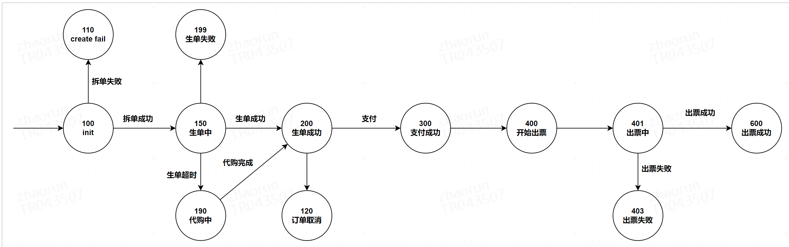
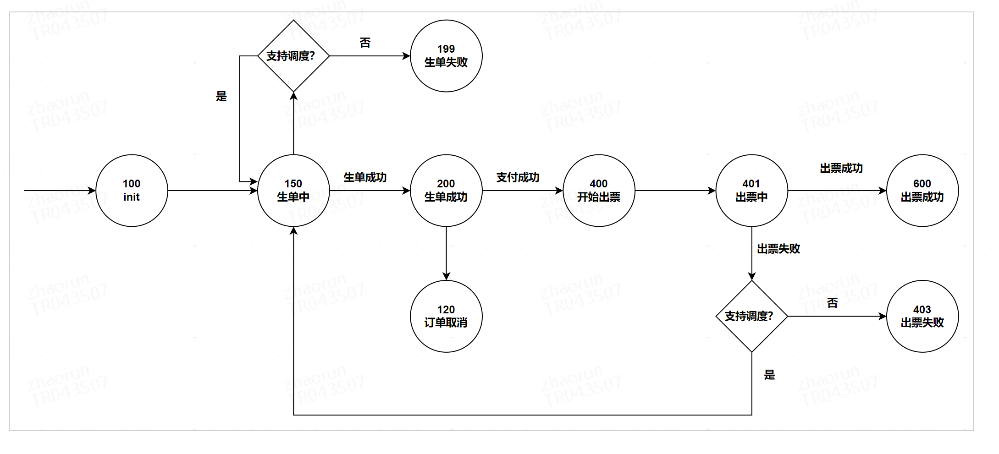
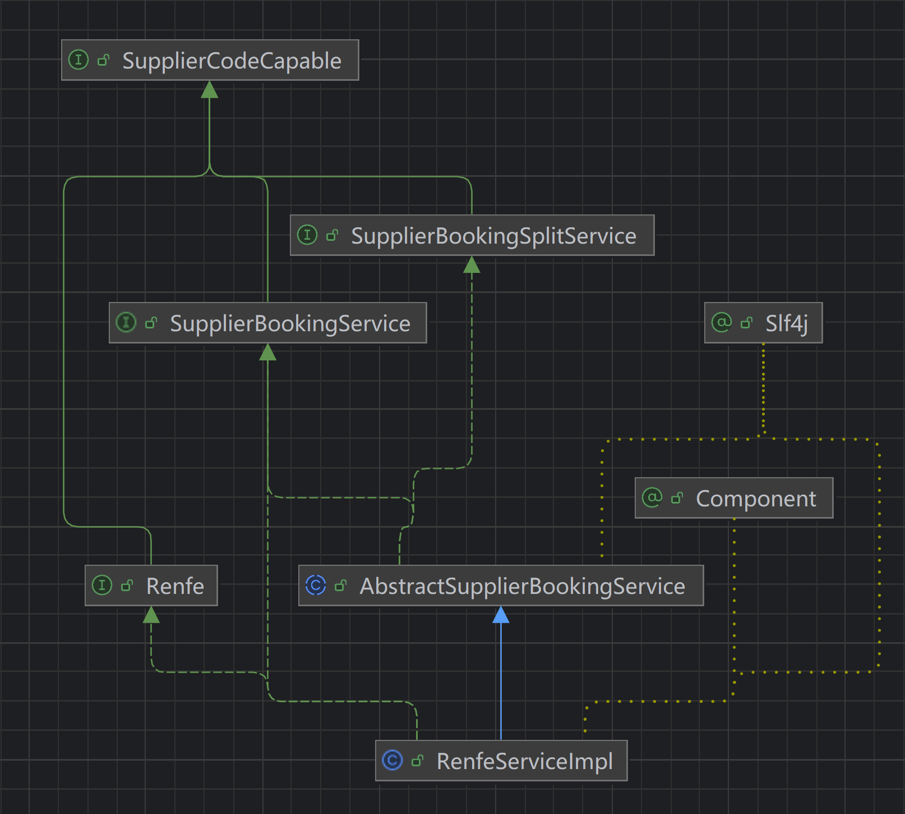

## 名词解释

* 套票 - 往返票里的特殊票种，fareSrc = 'r' 且 往返 journey 里的 fareId 相同，即往返是一张票，一般往返是去程返程各1张票
* 通票 - 能乘坐任何铁路公司、任何车次的票 ，非常方便，共有7种通票。 [通票具体介绍](http://conf.ctripcorp.com/pages/viewpage.action?pageId=1464915833)
* 原车拆 - 同一趟车的拆票，类似于国内火车的组合座， G123车次上海-北京，上海-杭州 3车厢，杭州-北京 6车厢
* 转乘拆 - 2趟车的拼接，上海 - 杭州 G111, 杭州 - 北京 G1223, 在杭州需换乘
* TIS uktis 英国火车供应商
* NTV itntv 意大利火车供应商
* Iryos renfe 西班牙

VC 供应平台 集成欧铁和英国铁路的供应商

Invoice：发票

主单(master order) 和子单 (sub order) ： 拆票流程（换乘）

主单就是用户下的换乘单，

子单根据拆票处理请求供应商的单。

* 单程
* 往返单
* return open

plus bus :X产品，客人购买后可以在出发站或者到达站，坐大巴去目的地

出境：渠道 （携程）

X 产品：

* DEFAULT("DEFAULT", -1),
* INSURANCE("INSURANCE", 11),
* PLUSBUS("PLUSBUS", 12),
* PASS("PASS", 13),
* RAILCARD("RAILCARD", 14),
* CARNET("CARNET", 15),
* SEASON("SEASON", 16),
* SELECT\_SEAT\_FEE("SELECT\_SEAT\_FEE", 17),
* SERVICE\_FEE("SERVICE\_FEE", 18),
* TRAINCARD("TRAINCARD", 19),
* BICYCLE\_SEAT("BICYCLE\_SEAT", 20);

订单状态转移





DDD

```
@Data
public class SolutionOfferPair implements Serializable {

    private static final long serialVersionUID = -8223294859973097827L;
    //车次信息，代表一趟车
    private String solutionId;
    //fareId 代表一辆车的坐席信息
    private String offerId;

    /**
     * 使用railcard之前的价格
     */
    private Amount railcardOriginPrice;

    private List<String> plusbusOfferIds;
    /**
     * 方案类型：0-普通搜，1-多票 代表多个fareId
     */
    private Integer solutionCategory;
}
```
## 字段/属性

# 流程

## 生单

create order -> split order -> create sub order

complete order ->

manual ticket

Solution （车次->p2p行程）-> fare (坐席)

生单->支付->出票

根据corelation id 判断一个子单

## offline

### 前端

page->ticket->主页面 List.jsx ->cm-search-wrap栏 + columns ( columns.js + 操作栏) + pagination（页码栏）

## 新票台

### 生单 create order

检验生单存在->生成主单->qmq异步生成子单

出票 complete order

check status->update pay status-> select all subOrders ->send complete to every subOrder

qmq :修改状态 -> 添加redis缓存?->通过qconfig获取代理商->getCrossIdcInstance()获取跨idc的client 调用gds-supplier-open-api的服务

## 老票台

生单由供应商具体的服务实现



###

## 问题：

* 状态机？
* idc？
* 缓存 orderItemId：子单出票重试
* complete success pdf upload :出票后会生成一个pdf
* order\_id和order\_item\_id 对应主单和子单， create\_order\_result base 64编码存储子单信息的压缩

## WORK

重构退改签功能，并且抽离出供应商细分部分，由上游完成。

# 技术

idc: Internet Data Center 数据中心 跨idc 问题：

## @PostMapping 400问题

请求类没有implement Serializable 无法序列化问题

## dubbo远程调用服务端反序列化问题

ServiceClient 编写有问题

排错

+ 同接口调用其他方法没问题
+ 堡垒调方法没问题 （堡垒没走client 直接调用sevice）
+ client有问题

## applyRefund

* 更改类
+ 添加Inner内部类
+ 返回对象ApplyRefundResult 、ApplyRefundItem 未来切换为票维度？
+ 封装ApplyRefundParam的额外信息 ExtraInfo

```
    public ApplyRefundResponse applyRefund(ApplyRefundRequest applyRefundRequest) {
        InnerApplyRefundRequest request = ApplyRefundMapping.instance.reqMap(applyRefundRequest);
        InnerApplyRefundResponse process = applyRefundProcessor.process(request);
        return ApplyRefundMapping.instance.rspMap(process);
    }
```

```
private List<ApplyRefundItem> outRefundItems;
private List<ApplyRefundItem> returnRefundItems;

private List<ApplyRefundTicket> refundTickets;
```

```
private List<String> supplierSegmentIds; // 供应商行程段 ID
private List<String> supplierTicketIds;
```

```
/**
 * 出票时间 yyyy-MM-dd HH:mm:ss(TIS)
 */
private String issueTime;

/**
 * 是否是改签流程中的退票(TIS)
 */
private Boolean isExchanging;

/**
 * 是否已改签过(TIS)
 */
private Boolean isExchanged;
```
* 更新流程
+ mticket校验去掉？
+ 退票走vc
+ order系统 某些功能下沉 （计算手续费）

####

