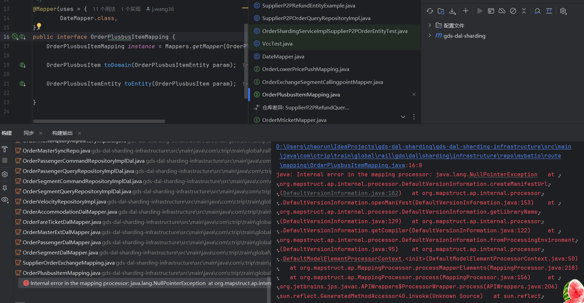

## MapStruct

MapStruct作为一个代码生成工具，它通过注解处理器自动生成基于Java bean的映射代码，极大地提高了开发效率并减少了出错的可能性。

通过编译时生成 Java 代码的方式来完成对象映射的，因此在运行时性能较高

用法

```
@Mapper(componentModel = "spring")
public interface OrderMapper {
    OrderDto orderToOrderDto(Order order);
}
```

```
 public OrderDto orderToOrderDto(Order order) {
        // MapStruct会在编译时生成具体的映射代码
        return OrderMapper.MAPPER.orderToOrderDto(order);
    	// return Mappers.getMapper(CreateOrderMapping.class).orderToOrderDto(order);
    }
```

子类型转换需要添加 uses
`@Mapper(uses = {RefundFlagEnum.class, SupplierSegmentMapping.class})`

-Djps.track.ap.dependencies=false [关闭idea依赖检查](https://blog.csdn.net/qq_41490274/article/details/113626605?spm=1001.2101.3001.6661.1&utm_medium=distribute.pc_relevant_t0.none-task-blog-2%7Edefault%7EBlogCommendFromBaidu%7ECtr-1-113626605-blog-139394791.235%5Ev43%5Epc_blog_bottom_relevance_base4&depth_1-utm_source=distribute.pc_relevant_t0.none-task-blog-2%7Edefault%7EBlogCommendFromBaidu%7ECtr-1-113626605-blog-139394791.235%5Ev43%5Epc_blog_bottom_relevance_base4&utm_relevant_index=1) 禁止跟踪注解处理器内部依赖项集合，从而使得IDEA的增量编译语言规则在这部分无效。

java: Can't generate mapping method from iterable type to non-iterable type.

集合类型不能放在参数第一个位置

* 映射的参数第一个不能放集合

## 状态机

`StateMachinePersister<S, E, T>` 是状态机的持久化接口类型，其中三个泛型参数含义如下：

* `S`：表示状态机的状态类型，通常是一个枚举类型，用于描述状态机的各个状态。
* `E`：表示状态机的事件类型，通常也是一个枚举类型，用于描述状态机中的事件。
* `T`：表示状态机的上下文类型，通常是一个实体类或者一个 DTO（Data Transfer Object），用于描述状态机的上下文信息，例如状态机所操作的对象、状态机的运行信息等等。

###

## 规范

* 契约 不能使用基本类型
* 数据库 varchar字段长度为16的倍数
*

## CDubbo

```
<!--自动配置cdubbo-->
<cdubbo:config/>

<!--同步调用，建议设置init=true，否则同时启用QSchedule时可能会报No application config的错误-->
<dubbo:reference id="demoService" interface="com.ctrip.cdubbo.demo.api.CDubboCodeService" init="true">
</dubbo:reference>
<!--异步调用-->
<dubbo:reference id="demoServiceAsync" interface="com.ctrip.cdubbo.demo.api.CDubboCodeService" init="true" async="true">
</dubbo:reference>
```
异步调用

```
  private CDubboCodeService demoServiceAsync;
```

```
    demoServiceAsync.sayHello(request);
    Future<CDubboCodeResponseType> future = RpcContext.getContext().getFuture();

  @Override
  public void setApplicationContext(ApplicationContext applicationContext) throws BeansException {
    demoServiceAsync = (CDubboCodeService) applicationContext.getBean("demoServiceAsync");
  }
```

java: JPS 增量注解进程已禁用。部分重新编译的编译结果可能不准确。使用构建进程“jps.track.ap.dependencies”VM 标志启用/禁用增量注解处理环境。

取消增量编译

```
<plugins>
    <plugin>
        <groupId>org.apache.maven.plugins</groupId>
        <artifactId>maven-compiler-plugin</artifactId>
        <version>3.8.1</version>
        <configuration>
          <useIncrementalCompilation>false</useIncrementalCompilation>
```
## 事务传递问题

* 场景：
+ 由于新票台治理，后续访问数据由mybatis改为dal
+ 新票台开发xorder createOrder落库中，需要落通用表和subxorder新表
+ 通用表复用老逻辑，使用mybatis，新表xorder使用DAl
+ 开启事务落库，@Transactional 只能回滚mybatis事务部分表，而使用只能回滚dal部分表，两个注解同时使用一个方法只能生效后者。
+ 使用事务传递，使用默认事务`REQUIRED` ，即该事务加入父事务，父事务失效？
+ 外层事务@Transactional 内层@DalTransactional 而DalTransactional无`(propagation = Propagation.REQUIRES\_NEW)`事务传递参数设置，无法开启新事务
+ 所以外层应该为@DalTransactional开启事务 内层开启新事务`@Transactional(propagation = Propagation.REQUIRES\_NEW)`

* 问题
+ 如何通过事务实现落库的原子化
* 解决
+ 全改成dal吧😅
+ 不要写事务，插入不需要判断

```
@DalTransactional(logicDbName = "trngdssuppliertransactiondatadb_dalcluster")
    public void saveOrder(CreateXOrderContext context) {
        CreateXOrderRequest request = context.getCreateXOrderRequest();
        boolean subXOrderSuccess = xOrderService.initSubXOrder(context);
        boolean ticketsSuccess = xOrderService.insertTickets(context);
        if (!subXOrderSuccess || !ticketsSuccess ) {
            throw new BusinessException(ErrorCodeEnum.DAL_ERROR);
        }
        context.getPassengerList().forEach(passenger -> passenger.setOrderItemId(context.getOrderItemId()));

        // 获取当前对象的代理对象
        XOrderLogic proxy = applicationContext.getBean(XOrderLogic.class);
        proxy.saveMasterOrder(context);

        supplierMasterOrderRepository.updateOrderMasterStatus(request.getOrderId(), request.getSubBatchId(),
            MasterOrderStatusChangeEvent.CREATE_ORDER_SUCCESS);
    }

    @Transactional(propagation = Propagation.REQUIRES_NEW)
    public void saveMasterOrder(CreateXOrderContext context) {
        CreateXOrderRequest request = context.getCreateXOrderRequest();
        // masterOrder subXOrder xOrderTicket Passenger *2
        boolean masterSuccess = masterOrderService.initOrder(request.getOrderId(), request);
        boolean passengerSuccess = supplierOrderPassengerRepository.insertPassenger(context.getPassengerList(),
            request.getOrderId(), request.getSubBatchId(), request.getUdl());

        boolean subOrderPassengerSuccess =
            supplierOrderPassengerRepository.insertSubOrderPassenger(context.getPassengerList(), request.getSubBatchId(), request.getUdl());
        if (!masterSuccess  || !subOrderPassengerSuccess || !passengerSuccess) {
            throw new BusinessException(ErrorCodeEnum.DAL_ERROR);
        }

    }
```

## 杂项小坑

MapConstruct 版本升级编译问题：



在您的 Intellij IDEA 中：

```
File | Settings | Build, Execution, Deployment | Compiler | user-local build process vm options
```
set this value （设置此值） ：

```
-Djps.track.ap.dependencies=false
```

 stringToLocalDateTime问题

`"2024-10-01"` 缺少时间

date2LocalDateTime问题

```
    public static LocalDateTime date2LocalDateTime(Date date) {
        if (Objects.isNull(date)) {
            return null;
        }
        Instant instant = date.toInstant();
        return LocalDateTime.ofInstant(instant, ZoneId.systemDefault());
    }
```
