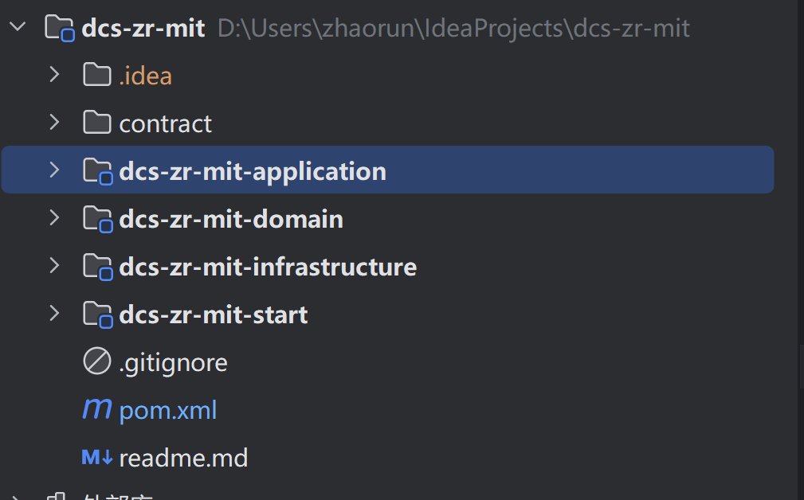
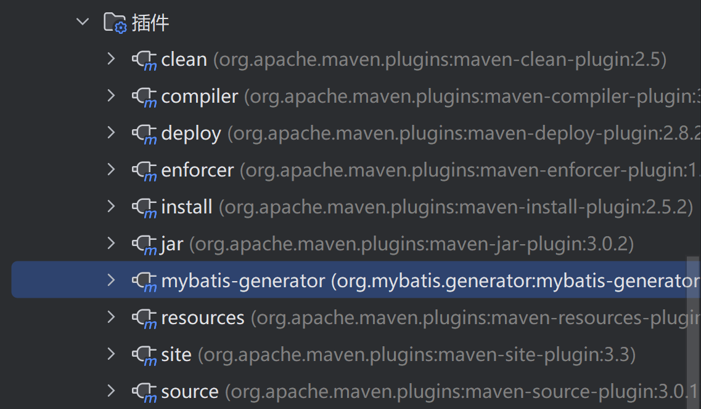
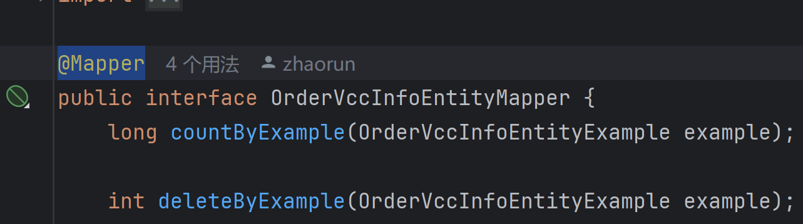

# 应用创建

## captain 申请一个应用 获取appid

## 创建项目 本地拉取git lab

### 1、使用mvn archetype:generate命令生成ddd包结构的项目

`mvn archetype:generate` `"-DgroupId=com.ctrip.dcs.mit"` `"-DartifactId=dcs-zc-mit"` `"-Dversion=1.0.0-SNAPSHOT"` `"-Dpackage=com.ctrip.dcs.mit.zc"` `"-DarchetypeArtifactId=ddd-archetype"` `"-DarchetypeGroupId=com.ctrip.dcs"` `"-DarchetypeVersion=2.1.0-SNAPSHOT"`

### 2、使用网页

[Framework Initializr (ctripcorp.com)](http://start.fx.ctripcorp.com/)

**PowerShell**创建项目



### 使用mvn archetype:generate命令生成ddd包结构的项目

`mvn archetype:generate` `"-DgroupId=com.ctrip.dcs.mit"` `"-DartifactId=dcs-zc-mit"` `"-Dversion=1.0.0-SNAPSHOT"` `"-Dpackage=com.ctrip.dcs.mit.zc"` `"-DarchetypeArtifactId=ddd-archetype"` `"-DarchetypeGroupId=com.ctrip.dcs"` `"-DarchetypeVersion=2.1.0-SNAPSHOT"`

POM添加

release 问题和插件解析问题 切换3.2 maven版本解决。

```
<build>
    <plugins>
        <!-- 添加maven-compiler-plugin插件 -->
        <plugin>
            <groupId>org.apache.maven.plugins</groupId>
            <artifactId>maven-compiler-plugin</artifactId>
            <version>3.6.0</version>
            <configuration>
                <source>1.8</source>
                <target>1.8</target>
            </configuration>
        </plugin>
        <!-- 添加maven-clean-plugin插件 -->
        <plugin>
            <groupId>org.apache.maven.plugins</groupId>
            <artifactId>maven-clean-plugin</artifactId>
            <version>3.2.0</version>
        </plugin>
        <!-- 添加maven-site-plugin插件 -->
        <plugin>
            <groupId>org.apache.maven.plugins</groupId>
            <artifactId>maven-site-plugin</artifactId>
            <version>3.12.1</version>
        </plugin>
    </plugins>
</build>
```
`git init`

`git remote add origin 远程仓库地址`

拉取`git pull origin main --allow-unrelated-histories`

1. idea创建来自版本源的项目 /`git clone`
2. 切换本地分支`git checkout -b feature\_zr`
3. 修改代码或添加 `git add`
4. `git commit -m "commit\_message"`
5. 设置推送上游`git push --set-upstream origin feature\_zr`
6. `merge request ->merge`

develop/base分支

1. `checkout develop/base`
2. `git pull`
3. choose feature\_zr to merge
4. push to origin

1. 我的分支依旧是在主分支上的修改
2. 我的提交很干净 不会包含别人的信息
注意：error: unable to create file gds-supplier-booking-supplier/src/main/java/com/ctrip/global/rail/gds/p2p/supplier/booking/gateway/treit/origin/picoservicemodel/sale/travelandsolutions/travel/SearchTravelSolutionRouteSummariesResponse2.java: Filename too long

**因为文件名太长，超出了Git的文件名长度限制**

`git config --system core.longpaths true`

* Snapshot检测不通过

原因：生产环境发布时禁止使用Snapshot的jar包，包括但不限于继承的parent pom、自身版本、生成契约版本、bom版本等。

`mvn install -DskipTests`

pass captain - > soa -> slb ->sitecontroller

pass captain : 流水线->镜像->group->发布->slb->dr

cdubbo

code first

contract first

# mybatis-generator

### 1、导入pom

```
<dependency>
    <groupId>org.mybatis.generator</groupId>
    <artifactId>mybatis-generator-core</artifactId>
    <version>1.4.0</version>
</dependency>
```
插件

```
<build>
    <plugins>
        <plugin>
            <configuration>
              <!--允许移动生成的文件 -->
              <verbose>true</verbose>
              <!-- 是否覆盖 -->
              <overwrite>true</overwrite>
              <!-- 自动生成的配置 -->
              <configurationFile>
                ../gds-ticketing-infrastructure/src/main/resources/mybatis/mybatis-generator-transaction-datasource.xml
              </configurationFile>
            </configuration>
        </plugin>
    </plugins>
</build>
```
### 2、修改generatorConfiguration文件

```
<?xml version="1.0" encoding="UTF-8"?>
<!DOCTYPE generatorConfiguration
        PUBLIC "-//mybatis.org//DTD MyBatis Generator Configuration 1.0//EN"
        "http://mybatis.org/dtd/mybatis-generator-config_1_0.dtd">
<generatorConfiguration>
    <context id="transactionDataSource" targetRuntime="MyBatis3">
        <!-- 防止生成的代码中有很多注释，加入下面的配置控制 -->
        <commentGenerator>
            <property name="suppressAllComments" value="true"/>
            <property name="suppressDate" value="true"/>
        </commentGenerator>
        <!-- 数据库连接 -->
        <jdbcConnection driverClass="com.mysql.jdbc.Driver"
           connectionURL="jdbc:mysql://trngdssuppliertransactiondata.mysql.db.fat.qa.nt.ctripcorp.com:55111/trngdssuppliertransactiondatadb"
           userId="us_test_zxsu"
           password="$RFV5tgb">
        </jdbcConnection>

        <javaTypeResolver>
            <property name="forceBigDecimals" value="false"/>
            <property name="useJSR310Types" value="true"/>
        </javaTypeResolver>

        <!-- 数据表对应的model层  -->
        <javaModelGenerator targetPackage="com.ctrip.train.global.rail.gds.ticketing.infrastructure.mybatis.transaction.model"
                            targetProject="src/main/java">
            <property name="constructorBased" value="false"/>
            <property name="immutable" value="false"/>
            <property name="enableSubPackages" value="true"/>
            <property name="trimStrings" value="true"/>
        </javaModelGenerator>

        <!-- sql assembly 映射配置文件 -->
        <sqlMapGenerator targetPackage="mybatis.mapper.transaction" targetProject="src/main/resources">
            <property name="enableSubPackages" value="true"/>
        </sqlMapGenerator>

        <!-- mybatis3中的mapper接口 -->
        <javaClientGenerator type="XMLMAPPER"
                             targetPackage="com.ctrip.train.global.rail.gds.ticketing.infrastructure.mybatis.transaction.mapper"
                             targetProject="src/main/java">
            <property name="enableSubPackages" value="true"/>
        </javaClientGenerator>

        <!-- 数据表进行生成操作 schema:相当于库名; tableName:表名; domainObjectName:对应的DO -->

<!--        <table tableName="supplier_master_order_log" domainObjectName="SupplierMasterOrderLogEntity"-->
<!--               enableCountByExample="true" enableUpdateByExample="true"-->
<!--               enableDeleteByExample="true" enableSelectByExample="true"-->
<!--               selectByExampleQueryId="true">-->
<!--        </table>-->
   </context>
</generatorConfiguration>
```
### 3、运行插件



### 4、生成mapper.xml，interface

注意：mapper需要自行添加注解！



### 5、调用

```
public OrderVccInfoEntity queryByCardLogId(String cardLogId){
    OrderVccInfoEntityExample example = new OrderVccInfoEntityExample();
    OrderVccInfoEntityExample.Criteria criteria = example.createCriteria();
    if (StringUtils.isNotBlank(cardLogId)) {
        criteria.andCardLogIdEqualTo(cardLogId);
    }
    List<OrderVccInfoEntity> orderVccInfoEntities = orderVccInfoEntityMapper.selectByExample(example);
    return CollectionUtils.isNotEmpty(orderVccInfoEntities) ? orderVccInfoEntities.get(0) : null;
}
```
# 引入SSO

## 1、引入依赖

```
<dependency>
  <groupId>com.ctrip.infosec</groupId>
  <artifactId>sso-client-new</artifactId>
  <version>1.0.1-Java21</version>
</dependency>
```
配置后端

```
@Configuration
public class ServletConfig {
    @Bean
    public ServletRegistrationBean logoutServletRegistration(){
        ServletRegistrationBean registration = new ServletRegistrationBean();
        registration.setServlet(new Logout());
        Collection<String> urlMappings = new ArrayList<>();
        urlMappings.add("/logout");
        registration.setUrlMappings(urlMappings);
        registration.setLoadOnStartup(2);
        return registration;
    }

    @Bean
    public FilterRegistrationBean someFilterRegistration() {

        FilterRegistrationBean registration = new FilterRegistrationBean();
        registration.setFilter(new CtripSSOFilter());
        registration.addUrlPatterns("/*");
        registration.setName("sessionFilter");
        registration.setOrder(999);
        return registration;
    }

    @Bean
    public FilterRegistrationBean crossFilterRegistration() {

        FilterRegistrationBean<Filter> registration = new FilterRegistrationBean();
        registration.setFilter(new CtripOriginFilter());
        registration.addUrlPatterns("/*");
        registration.setName("crossFilter");
        registration.setOrder(-1);
        return registration;
    }
```

```
@WebFilter(filterName = "CtripOriginFilter", urlPatterns = "/*", dispatcherTypes = {DispatcherType.REQUEST, DispatcherType.FORWARD}, asyncSupported = true)
public class CtripOriginFilter implements Filter
```
## 2、创建会话+权限校验路径配置文件permissionsconfig.xml

```
<modes version="2020">
  <mode name="ByPass">
    <path url="*.js"/>

    <path url="*.css"/>
  </mode>

  <mode name="PermissionsCheck">
    <path url="/ipacct/index22.html" type="page" modulecode="272001"/>
    <path url="/ipacct/sso/permission" type="api" modulecode="272001"/>
  </mode>
  <mode name="LoginCheck">
    <path url="/ipacct/index.html" type="page"/>
    <path url="/ipacct/sso/user" type="api"/>
  </mode>
</modes>
```

```
@Controller
public class LoginController {
    @GetMapping("/logout.do")
    public String logout(HttpServletRequest request, HttpServletResponse response) {
        return "redirect:/logout";
    }

    @GetMapping("/login.do")
    public String login(HttpServletRequest request, HttpServletResponse response) {
        return "redirect:/";
    }

    @GetMapping("/userInfo")
    @ResponseBody
    public String userInfo() {
        return UserInfoUtil.getUserId();
    }

}
```
## 3、[申请网关](http://gateway.fx.ctripcorp.com/#/service)

前端提示需要跨域

1. 前端的请求受到拦截，重定向到登录页面
2. 登录返回ticket
3. 前端携带ticket请求访问后端checkTicketController
4. 后端将请求转发至[url](https://cas.intranet.sso.infosec.ctripcorp.com/) ： 返回前端

```
public static UserLoginResponseType getTicketCheck(SsoRequestType model){
    Map<string,String>qmap = Qconfigclient.getmap(key:"ssourl.properties");
    String url = qmap.get("url").tostring()+"ticket/check";
    HttpUtility.Result result = HttpUtility.doPost(url,JSON.toJSoNString(model));
    return convertTicketDto(result);
}
```
5. 前端收到，saveCookie。正常访问

# 对象存储

[公有云对象存储 - 技术保障中心 - Confluence (ctripcorp.com)](http://conf.ctripcorp.com/pages/viewpage.action?pageId=981125568)

# 前端搭建

#### nvm install

npm install --legacy-peer-deps

 set NODE\_OPTIONS=--openssl-legacy-provider

node 降低版本

# 查看端口号占用情况

`netstat -aon|findstr "端口号"`

`tasklist|findstr "pid"`

