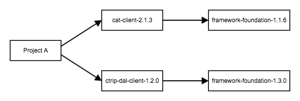
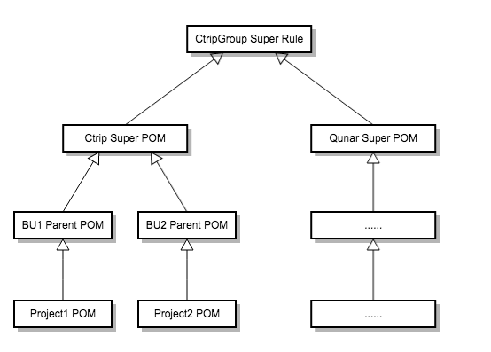
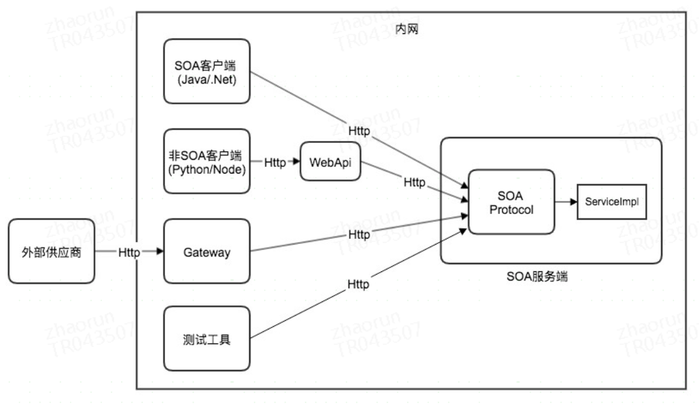
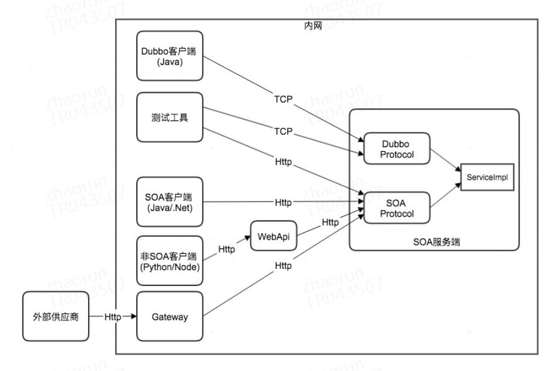
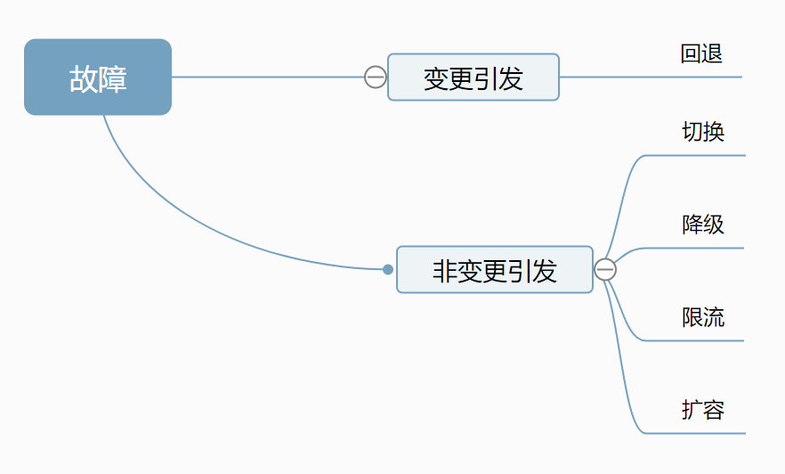
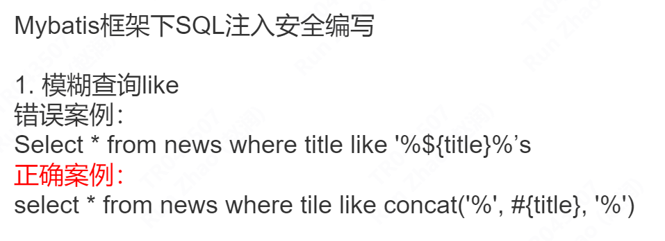
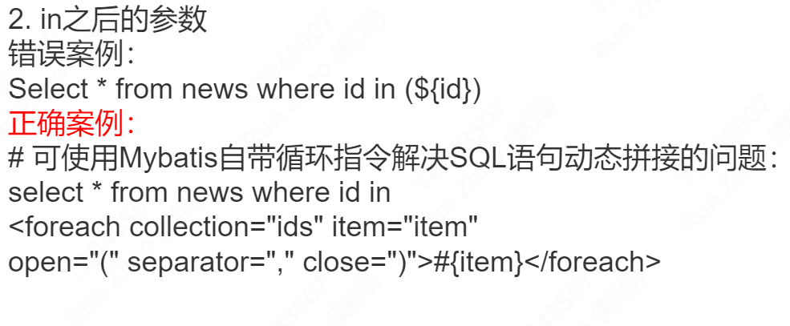
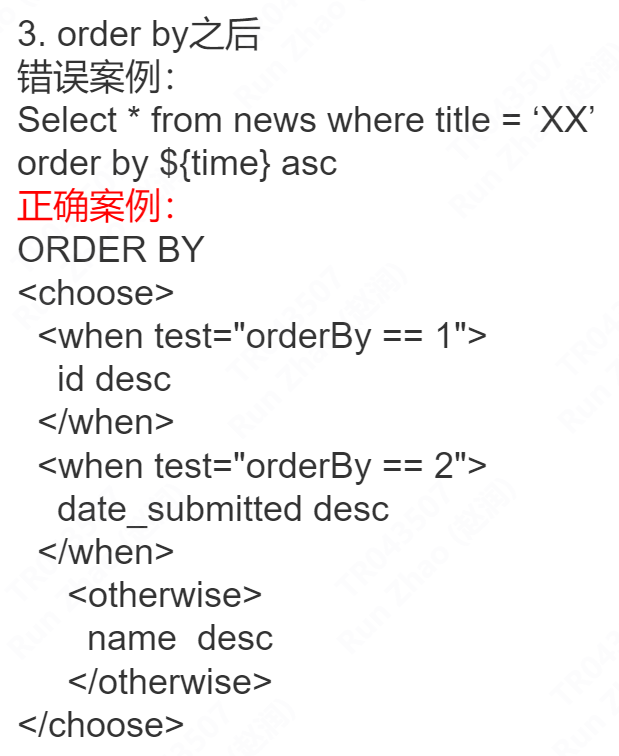

# 框架

## BOM

BOM（Bill of Materials）依赖管理工具，解决依赖版本问题

Ctrip Super POM用于定义携程公司所有Java项目都需要遵守的规范，所有Java项目都需要直接或间接继承自该POM（发布系统会做检查）。



### Parent POM

依赖层级 CtripGroup Super Rule -> Ctrip -> BU -> Project



## SOA

Service-Oriented Architecture 服务面向的基础框架 基于HTTP协议

<http://conf.ctripcorp.com/pages/viewpage.action?pageId=147175503>



## DAL

DAL Fx是一个跨语言的数据库访问框架。目前支持.Net，Java。Dal支持关系数据库。支持简单事务，不支持分布式事务。

DAL提供代码生成器来生成DAO代码和相应的配置文件。由于携程开发运行环境比较复杂，请不要通过调用DAL的API来试图编写自己的DAO。请先通过生成器创建DAO。目前代码生成器支持标准，构建和自定义DAO，可以满足所有需求

🆗 [Mybatis支持](https://docs.fx.ctripcorp.com/docs/dal/how-to/coreFunction/mybatis-dal)

🈶 分库分表：[数据库分库分表支持](https://docs.fx.ctripcorp.com/docs/dal/how-to/coreFunction/dbShardAndTableShard)

✅ 读写分离：[读写分离](https://docs.fx.ctripcorp.com/docs/dal/how-to/coreFunction/Read-Write-Splitting)

🉑 事务：[事务支持](https://docs.fx.ctripcorp.com/docs/dal/how-to/coreFunction/transaction)

* 支持简单事务，不支持分布式事务
* 支持配置事务超时时间
* 支持配置发生指定异常时不回滚事务

## CDubbo

基于阿里的dubbo



<http://conf.ctripcorp.com/pages/viewpage.action?pageId=152208746>

##

#

# 监控工具

## [CAT](http://conf.ctripcorp.com/display/FRAM/1.+Cat)

CAT应用监控系统（Central Application Tracking

是一个基于分布式Trace的实时监控系统。

<http://conf.ctripcorp.com/pages/viewpage.action?spaceKey=FRAM&title=CAT>、

* 跟踪每一个分布式调用的详细信息
* 监控服务运行快慢
* 监控应用异常情况
* 根据规则对应用系统的各种自定义事件进行监控告警

*Trace*

用于记录一次完整的请求处理，由多个Transaction和Event组成。

*Transaction*

用于表示Trace中的一个事务，有时间长度，支持嵌套

*Event*

用于表示Trace中的一个事件，不支持嵌套

## BAT

BAT（Better Application Tracking）是新一代All In One监控平台, 整合了Hickwall、BAT、Clog、ES Kibana等多个监控系统

* Hickwall: 指标(Metric)监控告警系统，覆盖携程所有的指标监控数据，包括系统层和应用层, 兼容业界的Prometheus监控标准； Hickwall看板配置已完全合并至 BAT
* BAT: Better Application Tracking, 携程应用监控系统, 主要用于应用的监控和故障发现。
* Clog: Ctrip Logging，携程日志系统，主要记录日志的内容是应用在运行时的info,error等等, 日志以appId为标识进行存储
* ES Kibana： 以scenario为出发点, 可由多个appid同时写入一个Scenario, 日志以scenario为标识进行存储，底层数据存储在ClickHouse

## MAT

MAT( Eclipse Memory Analyzer Tool) 是一个基于 Eclipse 平台的内存分析工具，可以用于分析 heap dump 文件，查找内存泄漏和大对象等问题。

## [Flight Recorder](https://docs.oracle.com/javacomponents/jmc-5-4/jfr-runtime-guide/about.htm#JFRUH170)

用于收集Java进程运行时的诊断信息，内存、cpu使用情况以及各种JVM内部和系统级别的事件，以便对此Java进程进行Profiling。

* 查看运行时哪些类分配内存最多，方便进行内存使用调优
* 查看运行时哪些执行路径占用最多CPU，方便进行CPU调优
* 查看上下文切换情况
* 查看IO情况

## [Dashboard](http://conf.ctripcorp.com/display/FRAM/5.+Dashboard)

Dashboard是一个基于时间序列的metric（性能数据或业务指标）数据看板

## [VI](http://conf.ctripcorp.com/display/FRAM/11.+VI)

vi主要为应用提供一个可视化工具，通过该工具可以对从应用启动到运行过程中的各种信息进行实时、可视化的监控与分析。

是validate internal的缩写，字面意思可以理解为“内部验证”,你也可以将VI理解为应用的窗口。 VI的一个目标就是把原本的应用黑盒子，变成一个透明的盒子。

1. 应用点火
1. 自定义点火逻辑，例如数据初始化，配置检查等
2. 启动全程可视化
3. 快速定位启动错误
4. 启动过程可回溯
5. 功能自检，确保应用正确性
2. 暴露应用状态
3. 性能监控
4. 组件依赖分析
5. 可视化管理缓存
6. 在线debug
7. 健康检查

# 组件

## [QConfig](https://docs.fx.ctripcorp.com/docs/java/java-study/FrameworkDocs/QConfig)

QConfig（Qunar Config Management Center），配置管理中心。主要提供配置集中管理、配置热更、灰度发布、版本追踪和发布回滚等功能。其中，借助QConfig的模板文件功能，可以将QConfig化身为业务量身定制的运营系统，现在很多业务的运营配置后台完全使用QConfig代替，使用人员不再局限于开发，运营、产品经理亦能轻松上手。

## [QMQ](https://docs.fx.ctripcorp.com/docs/java/java-study/FrameworkDocs/QMQ)

是由去哪儿网（Qunar）开源的一款强大且高度可定制的[消息中间件](https://so.csdn.net/so/search?q=%E6%B6%88%E6%81%AF%E4%B8%AD%E9%97%B4%E4%BB%B6&spm=1001.2101.3001.7020)，它旨在提供高性能、高可用性的消息传输服务。

消费者组C1/C2 内共享消费subject，消费组内C1消费一次subject。

## [QSchedule](https://docs.fx.ctripcorp.com/docs/java/java-study/FrameworkDocs/QSchedule)

### Qschedule Client

调度系统的客户端，用于周期性运行用户业务逻辑，同时又叫Worker

### Qschedule Manager

监控

### Qschedule Server

调试规则的执行者

## [SLB](https://docs.fx.ctripcorp.com/docs/java/java-study/FrameworkDocs/SLB)

SLB是携程的软负载系统，主要用于提供HTTP协议请求的路由负载功能，日处理请求量过百亿。

路由、负载均衡、缩容扩容、拉入拉出服务器、健康检测。

499 Code是客户端在请求SLB后，在获取到Response前，客户端断开了连接。此时由于连接已经断开，SLB无法将Response返回给客户端，SLB此时不管后端服务返回码是多少均记录为ErrorCode 499。并且客户端是服务接收到499状态码的，仅是SLB自己记录的状态码。499, client has closed connection

# 数据安全

分类分级

4个级别：L4、L3、L2、L1（重要性从高到低）

3个类别：用户数据（C）、商业数据（B）、公司数据（E)

可以在DBticket 和metadata主数据平台中，找到对应的数据表及字段后修改

* 用户手机号、用户证件号、用户邮箱必须使用神盾加密服务加密存储，不允许自行加密
* 用户银行卡号必须使用Keyws加解密服务加密存储在PCI区域

IAM是身份和访问管理（Identity and Access Management）的缩写，是一种用于管理用户身份和权限的技术。IAM通常被用于控制用户对系统中资源的访问，包括应用程序、数据、网络资源等，以保障系统的安全性和可靠性。

+ AES256、SM4：一般用于加密存储大量数据
+ RSA2048、SM2：一般用于签名或身份验证
+ SHA256、SM3：一般用于数据碰撞，关联分析

## RCA （Root Cause Analysis）

根本原因分析事件。这种事件是一种系统性的过程，旨在识别和解决公司内部出现的问题和故障。RCA 事件通常由一组跨职能团队共同参与，包括技术人员、经理、用户等。其目的是通过深入了解问题的根本原因，以便采取适当的措施来消除或减少类似问题的发生。

“可灰度”（可控制的灰度发布）是一种软件发布和部署技术，它通过逐步地将新版本的代码和功能发布给一小部分用户，以逐步降低部署带来的风险和影响，最终将新版本的代码和功能全面发布给所有用户。



## 常见业务安全风险

### 业务问题

* 注册场景 （密码复杂度、存储 、 批量注册）
* 登录场景（登录失败、重定向、暴力破解）
* 忘记密码（复杂度、存储、防止绕过token验证、链接加密、防止枚举）
* 短信验证码
* 下单
* 订单
* 优惠券
* 短连接

### 安全问题

* SQL注入
* XSS
+ 跨站脚本攻击（Cross-Site Scripting）的缩写，是一种Web安全漏洞。攻击者通过在Web应用程序中注入恶意脚本，从而在用户浏览器中执行恶意代码，从而获取用户敏感信息或者控制用户的浏览器。
- 关键cookie添加httponly安全标识位，防止会话身份窃取
- java建议使用信安安全API方法SecurityXssScript
* 暴力破解
* SSRF
* 文件读取
* CORS跨域
* 命令执行 bash
* 越权和未授权

高危漏洞修补：2个自然日

中危漏洞：7个工作日

低危漏洞：14个工作日







# [Java开发规范](https://docs.fx.ctripcorp.com/docs/java/java-study/JavaSpecInTrip)

## 编码

1. 预编译

```
//在某个地方预先编译Pattern，比如类的静态变量

private static Pattern pattern = Pattern.compile("[a-zA-Z]+");

//真正使用Pattern的地方
result = pattern.matcher("abc").matches();
```
2. 字符操作时，优先使用字符参数，而不是字符串，能提升性能
3. Arrays.asList() 方法返回的是一个固定长度的 List，它不支持添加或删除元素的操作。

##

## 代码

类超过1000行，方法超过500行扣，不重复扣分。

嵌套层次最多不要超过4层

## SonarQube

代码质量管理平台，SonarQube是一种用于代码检查和评估的自动化工具，用于帮助提高代码质量和可维护性。在使用SonarQube进行代码检查时，它会根据一系列规则和标准对代码进行分析，并产生一个问题报告（issue report）

* 行级别 ignore：在对应代码**行尾**添加注释 //NOSONAR
* function 级别 ignore：在 function 上添加 @SuppressWarnings("rule\_id") 注解

## 日志

* 统一使用slf4j的API记录日志到 CAT/Clog 选用 Log4j2 或者 Logback ，
* 禁止使用 System.out 或 System.error

|  |  |
| --- | --- |
| 级别 | 描述 |
| TRACE | 用于业务日志记录。 |
| DEBUG | 通常，DEBUG级别应该用于开发人员比较感兴趣的跟踪和调试信息，生产环境中默认为关闭状态。 |
| INFO | 通常，INFO消息被写入到控制台或与之相当的地方。因此，INFO 级别应该只用于相当重要的，对于最终用户和系统管理员有意义的消息。关键系统参数的回显、后台服务的初始化状态、需要系统管理员知会确认的关键信息都需要使用INFO级别。 |
| WARN | 指示潜在问题的消息级别。通常，WARNING消息应该描述最终用户或系统管理员感兴趣的事件，或者那些指示潜在问题的事件。 |
| ERROR | 指示错误的消息级别。通常，ERROR消息应该描述尽管出现错误但程序还可以继续运行的情况。 |
| FATAL | 指示严重失败的消息级别。FATAL消息应该描述相当重要的事件，这些事件会阻止正常程序的执行。它们对于最终用户和系统管理员来说应该是很容易理解的。 |

|  |  |  |
| --- | --- | --- |
| 名称 | 说明 | Demo |
| extraenv.sh | 1. Tomcat 启动脚本的扩展，即启动时执行，可以指定 JVM 启动参数 | [extraenv.sh](https://docs.fx.ctripcorp.com/assets/files/extraenv-17d61c47d7ffaa426c9327ce8ed8bf09.sh) |
| server.xml | 1. 即 Tomcat 的 server.xml2. PD 可以使用自己的 server.xml 来配置 Connector、指定线程池大小等3. 不能指定端口，端口使用占位符，由发布系统确定端口 | [server.xml](https://docs.fx.ctripcorp.com/assets/files/server-cac57d1a2072a282da252b7e9d6d80d8.xml) |

## git

git lab : 根据邮箱gen ssh key，add public key to gi lab, git clone by ssh。

```
ssh-keygen -t rsa -C "your_email@example.com"
```
 biz : business

 dal : Data Access Layer

--rebase选项：将本地分支的修改先暂存起来，然后将远程分支的提交记录通过“变基”操作合并到本地分支中，并在最后将暂存的修改应用到合并后的代码中。这种方式可以保持提交记录的线性，避免出现过多的分支合并记录。

--merge选项：直接将远程分支的提交记录合并到本地分支中，并创建一个新的合并节点记录提交历史。这种方式可以在提交记录中保留分支合并的历史记录，更容易理解代码变更的历史。

如果提交记录较为复杂或者需要保持提交历史的线性，可以选择使用--rebase选项。如果提交历史较为简单或者需要保留分支合并历史记录，可以选择使用--merge选项

# 表设计

delete\_flag、create\_time和datachange\_lasttime

# 名词解释

BU 的全称是 Business Unit

Corp：通常是 Corporation（公司）的简写，指的是企业或组织机构。

* Application：通过UI对外提供访问的应用
* Service：通过API方式提供访问的应用
* Job：定时执行特定操作的应用

* FAT Development and Testing Environment：开发测试环境
* FWS Functional Web Service：公共测试环境
* LPT Load and Performance Testing：性能测试环境
* UAT：集成测试环境
* PROD：生产环境
* Tooling：生产环境中的一个分区，可访问测试和UAT环境
* IDC：数据中心，部署服务器和相关设施的场所
* DR：Disaster Recovery 灾备，一个应用在多个IDC部署，确保单IDC故障时应用依然能正常提供服务 (参考文档：[DR部署](http://conf.ctripcorp.com/pages/viewpage.action?pageId=1372854576))
* GSLB：全局服务器负载均衡器，用于各个IDC之间的负载均衡，与DR密切相关
* LB：负载均衡器，负责进行负载均衡的硬件设备

堡垒机是在集群发布时首先拉出发布的一台机器，它上面运行的是新版本的应用。由于堡垒机已经从集群中拉出，所以它不会接受生产流量，需要在发布过程中可以使用堡垒测试平台向指定堡垒机发送请求来测试验证新版应用是否符合预期。

金丝雀测试（Canary testing）是一种将新版本或新功能的小部分应用于现有系统的测试方法。这种测试方法的目的是在生产环境中测试新版本或新功能的稳定性和可靠性，以便在全面部署之前发现并解决问题。

SRE Site Reliability Engineering

可观测性三要素

Metrics（度量）：记录可聚合的量化数据指标 ，例如：QPS（每秒请求次数）

Tracing（追踪）：记录单次请求事务的完整生命周期的路径，涵盖分布式系统中的各个节点

Logging（日志）：记录一些离散的事件信息，可以包含某个时刻的一些关键数据

