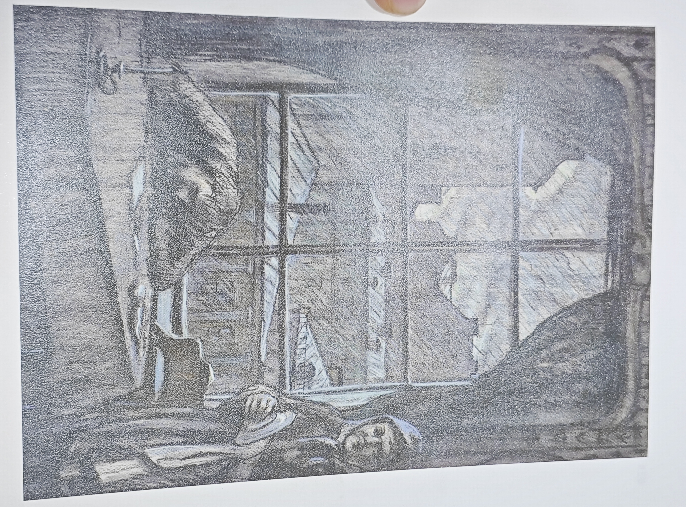

凌冬已至，冬天最好的消磨时间的方式就是阅读。

## 已读：

### 《荒原狼》

### 《克鲁采奏鸣曲》

#### 可能存在的爱情

故事发生在一辆夜间行驶的列车中，发生在几个人的对话中，发生在乘客对于爱情和婚姻的讨论中。一位杀妻男子开始讲述着他的经历，不禁引发读者深思……

#### 注定悲剧的婚姻

“我们好像两个囚犯，相互仇恨，却又被一根链条锁在一起，相互毒害对方而又竭力避而不见。我那时还不知道，百分之九十九的夫妇都过着这种地狱般的生活，而且不可能过别种生活。我那时既看不到别人的处境，也看不到自己的处境。

### 《魔鬼》

只是我告诉你们，凡看见妇女就动淫念的，这人心里已经与她犯奸淫了。

叶甫盖尼在结婚后因为经常看见从前的情人而发疯，最终走向自我毁灭和毁灭他人的道路……

是的，如果说叶甫盖尼·伊尔吉涅夫有精神病，那么，人人都有精神病。至于真正有精神病的人，无疑就

是那些在别人身上看到疯狂的症状，却看不到自己身上有这种症状的人。

恋情由于性欲满足而枯竭，我们的关系就剩下相互的对立，也就是说，我们是两个陌路相逢的利己主义者，都希望尽量从对方身上得到快乐。我说它口角,其实不是口角，而只是性欲满足后我们之间真实关系的大暴露。

我相信将来总有一天，也许不要很久，人们会醒悟过来，并且感到惊奇：我们的社会怎么能容许女人以刺激肉欲的打扮来扰乱公共治安？因为这无异于在大街小巷设置各种陷阱，甚至比这还要可怕！为什么要取缔赌博而不取缔袒胸露臂出卖色相的女人？她们比赌博还要危险一千倍！

正视一下上流社会荒淫无耻的生活，我们就会说，它简直是一座彻头彻尾的大窑子。您不同意吗？让我来向您证明，”他不让我插嘴，接着说，“您说，我们上流社会妇女的生活志趣毕竟跟妓女不同，我却认为没有什么差别。

严格地说，短期卖淫的妓女通常被人歧视，而长期卖淫的妓女却受到尊敬，差别就在这里。

禁欲修行大师列夫托尔斯泰。

### 《涅朵奇卡》

本书讲了一个女人的人生三段经历，第一段故事情节最为惊艳。托翁能够如此细致真实地刻画一个女孩的心理。主人公诞生在一个贫困家庭，父亲在她二岁的时候就离她而去，接着她的母亲改嫁一个小提琴家，故事由此开始。

#### 悲惨的小提琴家

继父叶菲莫夫是一名地主家的双簧乐手，但是乐队的小提琴师去世之后，他获得了其留下的小提琴，并且拒绝卖个他人，并且梦想成为最有名、最优秀的小提琴师。可是他就此堕落，并以贫穷为原因，放弃自己的小提琴生涯，但是又幻想着自己的成功。故事的前段一直在描写涅朵奇卡家庭的冲突，母亲承担着家庭的重担，而父亲却在外面酗酒、鬼混。父亲不断教唆着女儿偷母亲的钱，这一段情节对主人公的心理描写非常栩栩如生。矛盾一直积累直到故事的爆炸性高潮：一名法兰西的小提琴师来圣彼得堡表演。继父为了去见识其表演，掩盖他的自尊心受挫，又开始教唆女儿偷钱，接着又是一段心理斗争。故事的转折在偷钱被母亲识破，看着时钟走向演奏会的开幕，父亲心念的希望就要了结之时，父亲曾经结识的好朋友b和他的地主给他派来了演奏会门票。可看完演奏会回来的父亲却将母亲谋杀，自己开始痛苦的独奏，接着带着女儿逃走，可父亲就在这样一个动人心魄的夜晚离奇离世，留下女儿被好心公爵收养。

前段深刻动人地描写了底层穷苦家庭的生活场景，无止境的吵闹，矛盾。还有就是在如此家庭下长大的孩子的精神面貌，心理状态。无不处在一种紧绷，重压，看得读者喘不过气来。

#### 断线的后章

前文所述的伏笔在后章没了影子，我以为后文的发展是围绕女儿为了父亲的梦想而产生的故事，可惜并没有。前文提到的父亲结交的小提琴手B也在后文没了踪影，仅出现几次，没有起到推动情节发展的作用。

这本书可能是由于作者被捕而导致的中断，故事情节方面给人一种割裂感很强的感觉。前文故事情节描写非常连贯，一气呵成，读下来非常流畅。故事情节跌宕起伏，矛盾不断积累，悬链不断加深，在最后矛盾到达高潮，动人心魄。而接下

#### 同性恋的思考

第二部分的情节，是讲女主被伯爵收留后，与伯爵的女儿相爱的故事。居然是同性恋我有点意向不到。同性恋会对对方有生理冲动吗？按我的经验而言，我只会在面对异性时不由自主地感到紧张、幻想、冲动。这是埋藏在潜意识里的，是被唤起的，无法压抑的。而面对同性的亲密，我会自然而然感到恶心、远离，并且也不会自发产生对同性的爱欲，占有欲，不会感到紧张而是轻松；不会产生幻想而是现实；并且不会产生冲动，更不用提爱了。跟同性之间更多的感受到了友谊和排除了自身的孤独感。所以我很好奇，那些对同性产生所谓爱的，到底是什么样的感觉？是一种生理上的冲动？还是自己后发思维的强迫？有同性恋者说，异性恋之所以是异性恋是因为他们被社会灌输了固有的观念，而非他们自由的选择。那这样就打破了所谓‘先天同性恋’的观点，那既然如此，人真的会自我选择同性恋吗，那么他们需要克服生理冲动享受自己认为的爱情？还是说他们先天就没有生理冲动，对不同性别的体验天生就和我们‘正常人’不同？

### 悉达多

斋戒、等待、思考

斯多葛男人 悉达多

爱一个人，因他而受苦，在爱中迷失，变成一个傻子

追寻即意味着有一个目标，发现则意味着自由

智慧无法传授，智者试图传授智慧，听上去总是十分愚蠢

真理的反面亦是真理

河流是喜欢倾听的，

伤口开出了花

否定之否定

螺旋上升

轮回

唵

### 《白夜》-陀思妥耶夫斯基

单身、闲逛、幻想……

圣彼得堡的白夜是漫长的、难熬的、孤独的，大家匆匆忙忙赶往夏日山庄度假，留我一个人在这座城市空荡荡的飘荡……

主角在圣彼得堡的白夜期间在外闲逛偶遇心上人娜斯晶卡，可娜斯晶卡却在忧郁地等待她的心上人。在一段交往与矛盾挣扎后，娜斯晶卡决定放弃等待心上人而转向与主人公确定关系，而主人公已经开始畅享美好的未来……而就在这时，娜斯晶卡的心上人却不期而遇地到来，而她也最终抛弃了主人公奔向心上人的怀抱。

主人公被拒绝后：

“我扫清了天花板底下的蜘蛛网，如今您哪怕要结婚，要招待客人，都正是时候。”我望着玛特廖娜，她还是那个健旺得像年轻人的老婆子，可是不知为什么，她突然在我眼里变得目光无神，满脸皱纹，弯腰曲背，衰老不堪。

不知为什么在我眼里，我的房间突然显得像这个老婆子一样苍老了。墙壁和地板褪了色，一切黯淡无光；蜘蛛网各处纷披，比以前还多。不知为什么，我向窗外望了一眼，发现对面那所屋子也已变得破旧而又黯淡，圆柱上的灰泥已经销蚀剥落，房檐变得污黑，有了裂纹,墙原是鲜亮的深黄色，现在变得斑驳了……

也许是因为突然从云缝里透出来的阳光，又躲到乌云后面，一切在我眼中又显得黯淡起来；要不，也许是我未来的种种光景一一在我面前闪现，那样凄凉、那样令人寒心，我看到自己十五年以后还像现在一样，只是见老一些，还是在这个房间里，同样是孤身一人，还是和这同一个玛特廖娜在一起，过了这么些年，她一点也没有变得聪明一些。

全文的高潮：

可是我怎能记住你让我受的委屈，娜斯晶卡！要我在你的明朗安谧的幸福之上投一片乌云；要我狠狠地责备你，在你的心灵中引起愁闷，用隐秘的责难毒害你的心灵，在欢乐的时候迫使它痛苦地跳动；要我揉碎你同他一起走向圣坛时，插在你的乌黑的发里柔美的鲜花中哪怕一朵花……啊，决不，决不！但愿你的天空永远晴朗，你的甜蜜的微笑永远恬静而明亮，但愿你无限幸福，因为你曾把一段欢乐和幸福的时光给予另一颗孤独而感激的灵魂。

我的天！整整一段幸福的时光！难道这对人的一生来说还嫌短吗？……

……

难道我不能默默地端详一个少女？

心中怀着浸透甜蜜的怅惘与痛苦，

难道不能用眼睛追随她的身姿？

默默祝愿她欢乐，祝愿她幸福，

并且祝愿她一切如意，事事称心，

祝愿她精神愉快，生活无忧无虑，

甚至也祝福她所选择的意中人，

他将与这可爱的少女结为伴侣！

——《致××××》普希金

## 想读

###

### 《白痴》-陀思妥耶夫斯基

### 《伊凡·伊里奇之死》-列夫托尔斯泰

